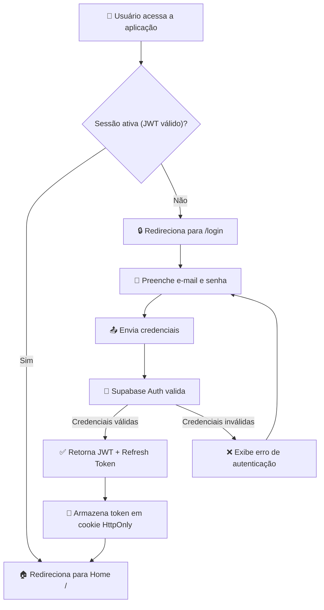
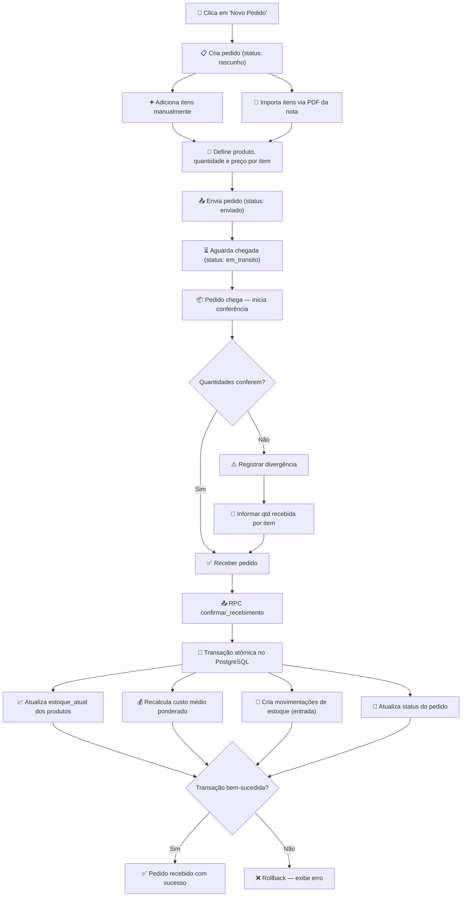
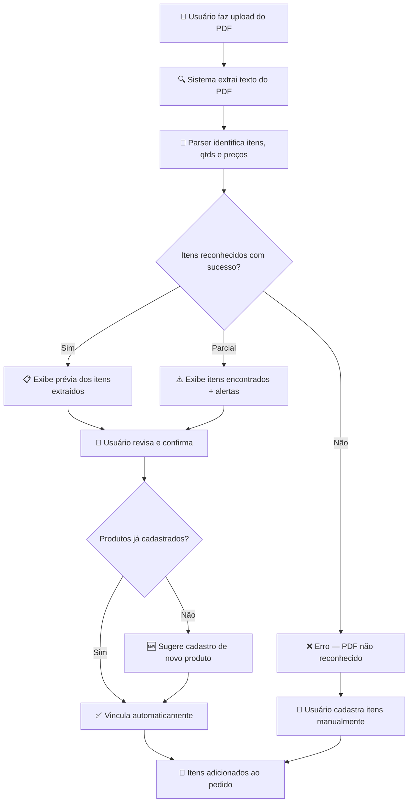
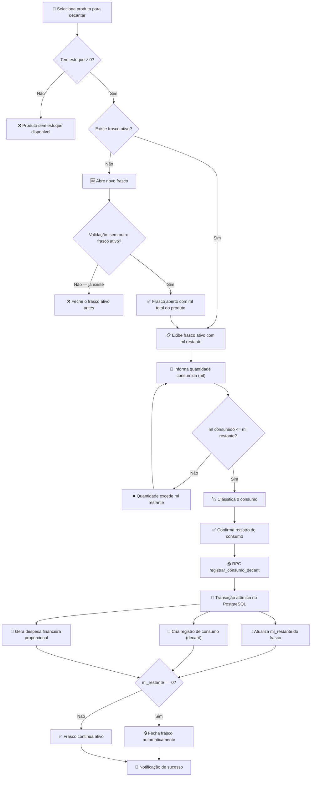
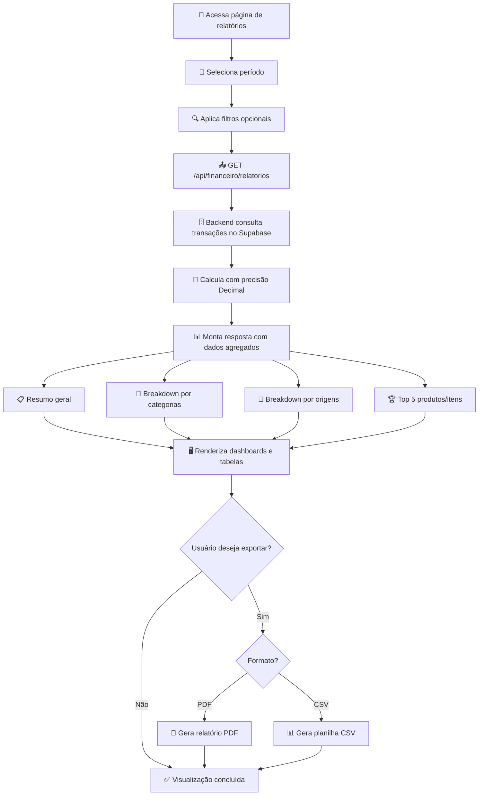
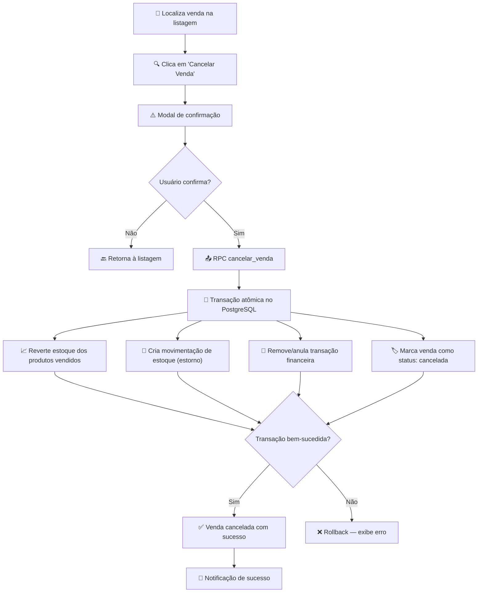
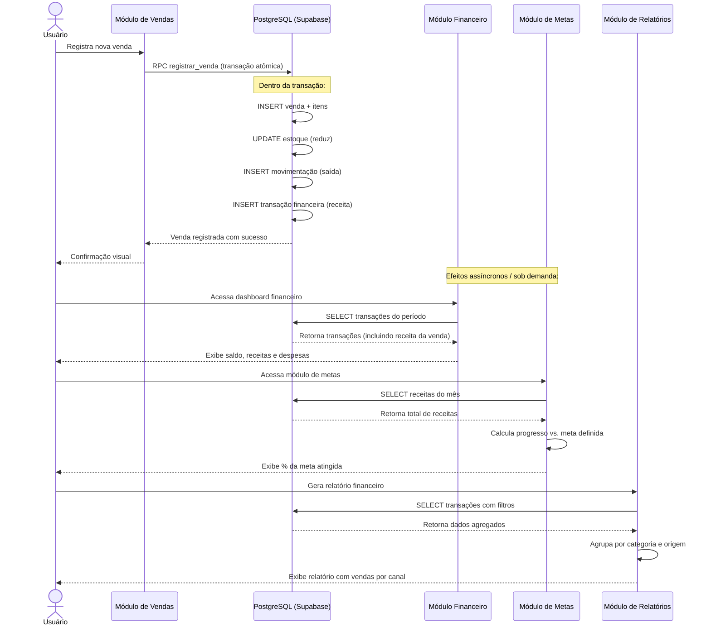
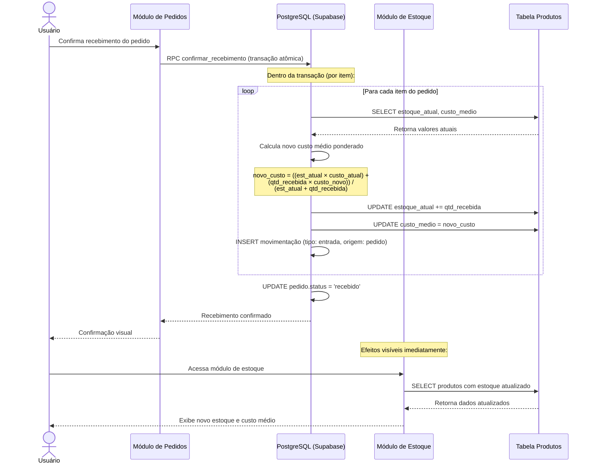

# 🔄 Fluxos de Usuário — Horus Parfum Control

> [!NOTE]
> Este documento descreve os fluxos passo a passo de como os usuários realizam as principais tarefas no sistema. Cada fluxo é acompanhado de um diagrama Mermaid para facilitar a visualização.

---

## Índice

1. [Fluxo de Login](#1--fluxo-de-login)
2. [Fluxo de Venda Completa](#2--fluxo-de-venda-completa)
3. [Fluxo de Pedido de Compra](#3--fluxo-de-pedido-de-compra)
4. [Fluxo de Decant (Consumo)](#4--fluxo-de-decant-consumo)
5. [Fluxo de Relatório Financeiro](#5--fluxo-de-relatório-financeiro)
6. [Fluxo de Cancelamento de Venda](#6--fluxo-de-cancelamento-de-venda)
7. [Fluxo de Dados: Venda → Financeiro](#7--fluxo-de-dados-venda--financeiro)
8. [Fluxo de Dados: Pedido → Estoque](#8--fluxo-de-dados-pedido--estoque)

---

## 1. 🔐 Fluxo de Login

O fluxo de autenticação é o ponto de entrada do sistema. Toda interação começa aqui.

### Resumo

```
Usuário → /login → email + senha → Supabase Auth → JWT → / (Home)
```

### Passos Detalhados

| Passo | Ação                                      | Componente / Responsável     |
| ----- | ----------------------------------------- | ---------------------------- |
| 1     | Usuário acessa a aplicação                | Navegador                    |
| 2     | Sistema verifica se há sessão ativa (JWT) | Middleware Next.js           |
| 3     | Sem sessão → redireciona para `/login`    | Middleware Next.js           |
| 4     | Usuário preenche e-mail e senha           | Formulário de login          |
| 5     | Credenciais enviadas ao Supabase Auth     | `supabase.auth.signInWithPassword()` |
| 6     | Supabase valida e retorna JWT + refresh   | Supabase Auth                |
| 7     | Token armazenado em cookie HttpOnly       | Middleware / Client           |
| 8     | Usuário redirecionado para `/` (Home)     | Router Next.js               |

### Diagrama



### Regras de Negócio Aplicáveis

- O JWT possui validade configurada no Supabase (padrão: 1 hora).
- O refresh token renova a sessão automaticamente antes da expiração.
- Rotas protegidas verificam o JWT no middleware antes de renderizar.
- Após 3 tentativas falhas consecutivas, o Supabase pode aplicar rate limiting.

> [!TIP]
> Consulte [[features/AUTENTICACAO]] para detalhes completos sobre a implementação de autenticação, incluindo gerenciamento de sessão e proteção de rotas.

---

## 2. 🛒 Fluxo de Venda Completa

Este é o fluxo principal de receita do negócio. Uma venda registra a saída de produtos/decants, gera receita financeira e atualiza o estoque automaticamente.

### Resumo

```
Usuário abre modal → seleciona canal → adiciona itens (produto/decant) →
define preço, taxa, frete → confirma → RPC registrar_venda →
{cria venda + itens, reduz estoque, cria movimentação, cria transação financeira}
```

### Passos Detalhados

| Passo | Ação                                        | Componente / Responsável        |
| ----- | ------------------------------------------- | ------------------------------- |
| 1     | Usuário clica em "Nova Venda"               | Botão na página de vendas       |
| 2     | Modal de venda é aberto                     | Componente `NovaVendaModal`     |
| 3     | Seleciona o canal de venda                  | Dropdown (Shopee, ML, Direto…)  |
| 4     | Busca e adiciona itens (produto ou decant)  | Campo de busca com autocomplete |
| 5     | Define quantidade, preço unitário por item  | Campos numéricos por item       |
| 6     | Informa taxa da plataforma (%) e frete (R$) | Campos opcionais                |
| 7     | Sistema calcula total e lucro estimado      | Cálculo em tempo real           |
| 8     | Usuário confirma a venda                    | Botão "Registrar Venda"         |
| 9     | Chamada à RPC `registrar_venda`             | API Route → Supabase RPC        |
| 10    | RPC executa dentro de transação atômica     | Função PostgreSQL               |

### Diagrama

```mermaid
flowchart TD
    A["👤 Clica em 'Nova Venda'"] --> B["📋 Abre modal de venda"]
    B --> C["📡 Seleciona canal de venda"]
    C --> D["🔍 Busca e adiciona itens"]
    D --> E{"Tipo do item?"}
    E -->|Produto (frasco)| F["🧴 Adiciona produto com qtd e preço"]
    E -->|Decant (ml)| G["💧 Adiciona decant com ml e preço"]
    F --> H["💰 Define taxa (%) e frete (R$)"]
    G --> H
    H --> I["🧮 Sistema calcula total e lucro"]
    I --> J["✅ Usuário confirma a venda"]
    J --> K["📤 Chamada RPC registrar_venda"]
    K --> L["🔄 Transação atômica no PostgreSQL"]
    L --> M["📝 Cria registro da venda"]
    L --> N["📦 Cria itens da venda"]
    L --> O["📉 Reduz estoque dos produtos"]
    L --> P["🔀 Cria movimentação de estoque (saída)"]
    L --> Q["💵 Cria transação financeira (receita)"]
    M & N & O & P & Q --> R{"Transação bem-sucedida?"}
    R -->|Sim| S["✅ Venda registrada com sucesso"]
    R -->|Não| T["❌ Rollback — exibe erro"]
    T --> B
    S --> U["🔔 Notificação de sucesso ao usuário"]
```

### Operações da RPC `registrar_venda`

A RPC executa as seguintes operações dentro de uma **transação atômica** (tudo ou nada):

1. **Cria o registro da venda** na tabela `vendas` com status `concluida`.
2. **Cria os itens da venda** na tabela `venda_itens`, vinculados à venda.
3. **Reduz o estoque** de cada produto vendido na tabela `produtos` (campo `estoque_atual`).
4. **Cria movimentações de estoque** na tabela `movimentacoes` com tipo `saida` e origem `venda`.
5. **Cria uma transação financeira** na tabela `transacoes` com tipo `receita` e categoria `venda`.

> [!WARNING]
> Se o estoque de qualquer item for insuficiente, a RPC rejeita a venda inteira e faz rollback. Nenhuma operação parcial é persistida.

> [!IMPORTANT]
> O cálculo de lucro utiliza o **custo médio** do produto no momento da venda. Esse custo é atualizado automaticamente ao receber pedidos de compra. Consulte [[REGRAS_NEGOCIO]] para a fórmula de custo médio.

---

## 3. 📦 Fluxo de Pedido de Compra

Pedidos de compra são o mecanismo de entrada de estoque. Um pedido passa por vários estados até ser recebido e integrado ao estoque.

### Resumo

```
Criar pedido → adicionar itens (produto, qtd, preço) → enviar pedido →
aguardar chegada → conferência → {qtd ok → receber / qtd diferente → registrar divergência} →
RPC confirmar_recebimento → {atualiza estoque, custo médio, cria movimentações}
```

### Estados do Pedido

| Estado        | Descrição                                        |
| ------------- | ------------------------------------------------ |
| `rascunho`    | Pedido criado, itens sendo adicionados           |
| `enviado`     | Pedido confirmado e enviado ao fornecedor        |
| `em_transito` | Pedido em trânsito / aguardando chegada          |
| `recebido`    | Pedido recebido e conferido sem divergências     |
| `divergente`  | Pedido recebido com diferença de quantidade      |
| `cancelado`   | Pedido cancelado antes do recebimento            |

### Diagrama — Fluxo Principal



### Sub-fluxo: Importação de PDF da Nota Fiscal

O sistema permite importar itens de um pedido diretamente a partir do PDF da nota fiscal do fornecedor, agilizando o cadastro.



> [!TIP]
> O parser de PDF foi otimizado para notas fiscais de fornecedores recorrentes. Para novos fornecedores, a primeira importação pode exigir revisão manual. Consulte [[features/PEDIDOS]] para detalhes da implementação do parser.

### Operações da RPC `confirmar_recebimento`

1. **Atualiza `estoque_atual`** de cada produto: `estoque_atual += qtd_recebida`.
2. **Recalcula custo médio ponderado**: `((estoque_anterior × custo_anterior) + (qtd_nova × custo_novo)) / estoque_total`.
3. **Cria movimentações** na tabela `movimentacoes` com tipo `entrada` e origem `pedido`.
4. **Atualiza status do pedido** para `recebido` ou `divergente`.
5. Em caso de divergência, registra a diferença para acompanhamento.

---

## 4. 💧 Fluxo de Decant (Consumo)

O fluxo de decant registra o consumo de perfume a partir de frascos abertos. Cada consumo gera um registro detalhado e impacta o financeiro como despesa.

### Resumo

```
Abrir frasco (validação: estoque > 0, sem frasco ativo) →
registrar consumo (ml, classificação) →
RPC registrar_consumo_decant →
{atualiza ml_restante, cria registro decant, gera despesa financeira}
```

### Passos Detalhados

| Passo | Ação                                              | Componente / Responsável           |
| ----- | ------------------------------------------------- | ---------------------------------- |
| 1     | Usuário seleciona produto para decantar           | Lista de produtos                  |
| 2     | Sistema verifica estoque e frasco ativo            | Validação no frontend + backend   |
| 3     | Se não há frasco ativo, abre novo frasco           | Modal "Abrir Frasco"               |
| 4     | Informa a quantidade consumida (ml)                | Campo numérico                     |
| 5     | Classifica o tipo de consumo                       | Dropdown (venda, uso pessoal, etc) |
| 6     | Confirma o registro de consumo                     | Botão "Registrar Consumo"          |
| 7     | Chamada à RPC `registrar_consumo_decant`           | API Route → Supabase RPC           |
| 8     | Sistema atualiza ml restante e gera financeiro     | Transação atômica PostgreSQL       |

### Diagrama



### Operações da RPC `registrar_consumo_decant`

1. **Atualiza `ml_restante`** do frasco ativo: `ml_restante -= ml_consumido`.
2. **Cria registro de consumo** na tabela de decants com dados do consumo (ml, classificação, data).
3. **Gera despesa financeira** proporcional ao custo médio do produto: `despesa = (ml_consumido / ml_total_frasco) × custo_medio`.
4. **Fecha frasco** automaticamente se `ml_restante` chegar a zero.

> [!IMPORTANT]
> A despesa financeira gerada pelo consumo de decant é calculada com base no **custo médio** do produto no momento do consumo, garantindo precisão contábil. Veja [[features/DECANTS]] para detalhes.

---

## 5. 📊 Fluxo de Relatório Financeiro

Os relatórios financeiros agregam dados de vendas, despesas e decants para fornecer uma visão consolidada do desempenho do negócio.

### Resumo

```
Selecionar período → GET /api/financeiro/relatorios →
backend calcula com Decimal → exibe resumo + categorias + origens + top5 →
exportar PDF/CSV
```

### Passos Detalhados

| Passo | Ação                                                 | Componente / Responsável          |
| ----- | ---------------------------------------------------- | --------------------------------- |
| 1     | Usuário acessa a página de relatórios                | Página `/relatorios`              |
| 2     | Seleciona o período desejado (data início e fim)     | Date picker                       |
| 3     | Opcionalmente filtra por categoria ou origem         | Filtros adicionais                |
| 4     | Sistema faz `GET /api/financeiro/relatorios`         | API Route Next.js                 |
| 5     | Backend busca transações do período no Supabase      | Query com filtros de data         |
| 6     | Cálculos realizados com precisão `Decimal`           | Biblioteca de precisão decimal    |
| 7     | Retorna resumo, categorias, origens e top 5          | JSON response                     |
| 8     | Frontend renderiza dashboards e tabelas              | Componentes de visualização       |
| 9     | Usuário pode exportar para PDF ou CSV                | Botões de exportação              |

### Diagrama



### Estrutura da Resposta da API

```json
{
  "resumo": {
    "receita_total": "15230.50",
    "despesa_total": "8420.00",
    "lucro_liquido": "6810.50",
    "margem_percentual": "44.72"
  },
  "por_categoria": [
    { "categoria": "venda", "total": "12500.00" },
    { "categoria": "decant", "total": "2730.50" }
  ],
  "por_origem": [
    { "origem": "shopee", "total": "8200.00" },
    { "origem": "mercado_livre", "total": "4300.00" },
    { "origem": "direto", "total": "2730.50" }
  ],
  "top5_produtos": [
    { "produto": "Sauvage EDP 100ml", "total": "3200.00", "qtd_vendida": 8 }
  ]
}
```

> [!WARNING]
> Todos os cálculos financeiros utilizam a biblioteca `Decimal` no backend para evitar erros de ponto flutuante. **Nunca** use `float` para valores monetários. Consulte [[features/FINANCEIRO]] e [[features/RELATORIOS]] para detalhes.

---

## 6. ❌ Fluxo de Cancelamento de Venda

O cancelamento de venda é uma operação de reversão que desfaz todos os efeitos de uma venda registrada.

### Resumo

```
Selecionar venda → confirmar cancelamento → RPC cancelar_venda →
{reverte estoque, remove transação financeira, marca venda como cancelada}
```

### Passos Detalhados

| Passo | Ação                                                | Componente / Responsável     |
| ----- | --------------------------------------------------- | ---------------------------- |
| 1     | Usuário localiza a venda na listagem                | Página de vendas             |
| 2     | Clica em "Cancelar Venda"                           | Botão de ação                |
| 3     | Sistema exibe modal de confirmação                  | Modal de confirmação         |
| 4     | Usuário confirma o cancelamento                     | Botão "Confirmar"            |
| 5     | Chamada à RPC `cancelar_venda`                      | API Route → Supabase RPC     |
| 6     | RPC executa reversão em transação atômica           | Função PostgreSQL            |

### Diagrama



### Operações da RPC `cancelar_venda`

1. **Reverte estoque**: `estoque_atual += qtd_vendida` para cada item da venda.
2. **Cria movimentação de estorno**: registro na tabela `movimentacoes` com tipo `entrada` e origem `estorno_venda`.
3. **Remove/anula transação financeira**: a transação de receita associada é marcada como anulada ou removida.
4. **Atualiza status da venda**: de `concluida` para `cancelada`.

> [!WARNING]
> O cancelamento de venda **não** recalcula o custo médio dos produtos. Se o custo médio foi alterado desde a venda original, o estoque retorna com o custo médio atual. Veja [[REGRAS_NEGOCIO]] para mais detalhes.

> [!IMPORTANT]
> Apenas vendas com status `concluida` podem ser canceladas. Vendas já canceladas não podem ser canceladas novamente.

---

## 7. 💰 Fluxo de Dados: Venda → Financeiro

Este diagrama de sequência mostra como uma venda impacta o módulo financeiro, desde o registro até a influência em metas e relatórios.

### Conceito

- **Venda gera transação de entrada (receita)**: ao registrar uma venda, uma transação financeira do tipo `receita` é criada automaticamente.
- **Receita contribui para metas financeiras**: metas de faturamento são auto-calculadas com base nas transações de receita do período.
- **Relatórios financeiros incluem vendas por origem**: o breakdown por origem nos relatórios é alimentado pela origem (canal) registrada em cada venda.

### Diagrama de Sequência



### Impacto Financeiro de uma Venda

| Campo                     | Origem                                      | Cálculo                                                     |
| ------------------------- | ------------------------------------------- | ------------------------------------------------------------ |
| Receita bruta              | Soma dos preços dos itens                   | `Σ (preço_unitário × quantidade)`                           |
| Taxa da plataforma         | Percentual do canal                         | `receita_bruta × (taxa / 100)`                              |
| Frete                      | Informado manualmente                       | Valor fixo                                                   |
| Receita líquida            | Receita menos custos                        | `receita_bruta - taxa - frete`                               |
| Custo dos produtos         | Custo médio no momento da venda             | `Σ (custo_medio × quantidade)`                              |
| Lucro líquido              | Receita menos custos                        | `receita_liquida - custo_produtos`                           |
| Transação financeira       | Gerada automaticamente                      | Tipo `receita`, valor = `receita_liquida`                    |

---

## 8. 📦 Fluxo de Dados: Pedido → Estoque

Este diagrama de sequência mostra como o recebimento de um pedido de compra atualiza o inventário, custos e gera as movimentações correspondentes.

### Conceito

- **Pedido recebido → custo médio atualizado**: ao confirmar o recebimento, o custo médio ponderado de cada produto é recalculado com base na nova entrada.
- **Movimentações criadas**: cada item recebido gera uma movimentação de estoque do tipo `entrada`.
- **Estoque atual incrementado**: a quantidade em estoque é somada à quantidade recebida.

### Diagrama de Sequência



### Fórmula do Custo Médio Ponderado

```
novo_custo_medio = (estoque_anterior × custo_medio_anterior) + (qtd_recebida × custo_unitario_novo)
                   ─────────────────────────────────────────────────────────────────────────────────
                                          estoque_anterior + qtd_recebida
```

### Exemplo Prático

| Dado                   | Valor       |
| ---------------------- | ----------- |
| Estoque anterior       | 5 unidades  |
| Custo médio anterior   | R$ 120,00   |
| Quantidade recebida    | 3 unidades  |
| Custo unitário novo    | R$ 150,00   |
| **Novo estoque**       | **8 unid.** |
| **Novo custo médio**   | **(5 × 120 + 3 × 150) / 8 = R$ 131,25** |

> [!NOTE]
> O custo médio é fundamental para o cálculo de lucro nas vendas e para a valorização do estoque. Consulte [[features/ESTOQUE]] e [[REGRAS_NEGOCIO]] para mais detalhes sobre as regras de estoque e custo médio.

---

## 📋 Resumo dos Fluxos e RPCs

| Fluxo                   | RPC Principal              | Tabelas Impactadas                                         |
| ----------------------- | -------------------------- | ---------------------------------------------------------- |
| Venda Completa          | `registrar_venda`          | `vendas`, `venda_itens`, `produtos`, `movimentacoes`, `transacoes` |
| Pedido de Compra        | `confirmar_recebimento`    | `pedidos`, `pedido_itens`, `produtos`, `movimentacoes`      |
| Decant (Consumo)        | `registrar_consumo_decant` | `frascos`, `decants`, `transacoes`                          |
| Cancelamento de Venda   | `cancelar_venda`           | `vendas`, `produtos`, `movimentacoes`, `transacoes`         |
| Relatório Financeiro    | —                          | `transacoes` (leitura)                                      |

---

## 📎 Documentos Relacionados

- [[features/VENDAS]] — Detalhes da funcionalidade de vendas
- [[features/PEDIDOS]] — Detalhes da funcionalidade de pedidos de compra
- [[features/DECANTS]] — Detalhes da funcionalidade de decants e consumo
- [[features/FINANCEIRO]] — Módulo financeiro e transações
- [[features/RELATORIOS]] — Relatórios e exportações
- [[features/AUTENTICACAO]] — Autenticação e gerenciamento de sessão
- [[features/ESTOQUE]] — Gestão de estoque e movimentações
- [[features/METAS]] — Metas financeiras e acompanhamento
- [[REGRAS_NEGOCIO]] — Regras de negócio detalhadas (custo médio, validações, etc.)
- [[BANCO]] — Estrutura do banco de dados e tabelas
- [[API]] — Documentação das rotas de API
- [[ARQUITETURA]] — Visão geral da arquitetura do sistema
