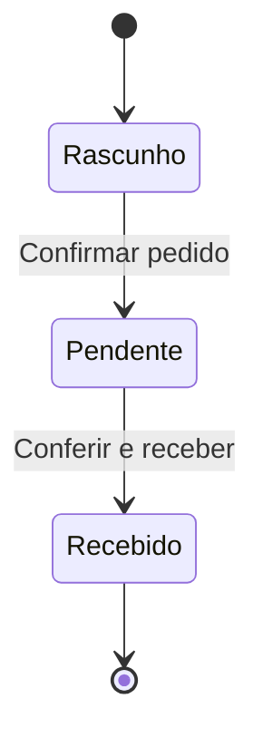
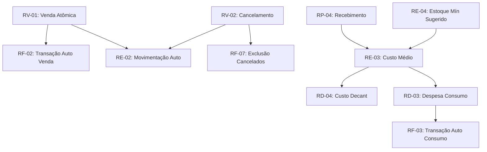

# 📏 Regras de Negócio

> Documento consolidado com **todas as regras de negócio** do sistema Horus Parfum Control.
> Este é o documento de referência para validações, cálculos e comportamentos esperados em cada módulo.

---

## 📋 Regras Gerais

### RG-01 — Público-alvo do Sistema

O Horus Parfum Control é um sistema **interno** (ERP) projetado para **3 a 4 usuários** simultâneos: os donos da perfumaria artesanal e eventuais operadores. Não é um sistema voltado ao consumidor final.

### RG-02 — Padrão Monetário

- Todos os valores monetários são em **BRL (Real Brasileiro)**
- Sempre exibir com **2 casas decimais**
- Usar a função `formatBRL()` para formatação de exibição no frontend (ex: `R$ 1.234,56`)
- Usar **`Decimal.js`** no frontend e **`Decimal`** (Python) no backend para cálculos financeiros, evitando erros de ponto flutuante

> [!IMPORTANT]
> **Nunca** usar `float` ou `number` nativo para cálculos financeiros. A biblioteca `Decimal.js` é obrigatória para qualquer operação aritmética com dinheiro.

### RG-03 — Auditabilidade

Cada ação relevante no sistema deve registrar o **usuário responsável** (`user_id`). Isso inclui:
- Criação e edição de transações
- Vendas e cancelamentos
- Recebimento de pedidos
- Abertura de frascos e consumo de decants

### RG-04 — Identidade Visual

O sistema utiliza **dark theme** com identidade visual inspirada na mitologia egípcia (Olho de Horus):
- Cor de destaque principal: **Gold (#C9A84C)**
- Tipografia premium com fontes Inter, Cormorant Garamond e JetBrains Mono
- Efeitos visuais: glassmorphism, glow cards, elementos 3D

### RG-05 — Timezone

- Todas as datas são armazenadas em **UTC** no banco de dados (Supabase/PostgreSQL)
- O frontend converte para o fuso horário local do usuário na exibição

---

## 💰 Regras Financeiras

### RF-01 — Origem das Transações

Toda transação financeira tem uma **origem** que define como ela foi criada:

| Origem | Tipo | Criação |
|---|---|---|
| `manual` | Entrada ou Saída | Criada manualmente pelo usuário |
| `venda` | Entrada | Gerada automaticamente ao registrar uma venda |
| `decant` | Saída | Gerada automaticamente ao registrar consumo de decant |

### RF-02 — Transações Automáticas de Vendas

Quando uma **venda é registrada**, o sistema gera automaticamente uma **transação de entrada** (receita) com:
- Valor = total líquido da venda
- Categoria = `vendas`
- Origem = `venda`
- Referência ao ID da venda

### RF-03 — Transações Automáticas de Consumo

Quando um **consumo de decant** é registrado (tipos: perda, amostra, brinde, marketing, uso_interno), o sistema gera automaticamente uma **transação de saída** (despesa) com:
- Valor = ml consumidos × custo médio por ml do produto
- Categoria = tipo do consumo
- Origem = `decant`

### RF-04 — Precisão Decimal nos Relatórios

Os relatórios financeiros da API utilizam o tipo `Decimal` do Python para **todos os cálculos**:
- Soma de receitas e despesas
- Cálculo de saldo
- Agrupamentos por categoria
- Evolução mensal

Os valores são retornados como **strings** na resposta JSON para preservar a precisão decimal.

### RF-05 — Metas Financeiras — Progresso Automático

- **Metas monetárias** (`tipo: "monetaria"`): o progresso é calculado **automaticamente** com base nas receitas (transações de entrada) dentro do período da meta
  - `progresso = (valor_atual / valor_alvo) × 100`
  - Limitado a 100% (não ultrapassa)
- **Metas percentuais** (`tipo: "percentual"`): o valor atual deve ser **atualizado manualmente** pelo usuário (ex: margem de lucro)

### RF-06 — Saldo Histórico

O saldo histórico é um valor **acumulado desde o início do sistema**:

```
saldo_histórico = Σ(todas_entradas) - Σ(todas_saídas)
```

> [!NOTE]
> O saldo histórico é diferente do saldo do período. O saldo do período considera apenas as transações dentro das datas filtradas.

### RF-07 — Exclusão de Cancelados

Transações vinculadas a **vendas canceladas** são **excluídas** de:
- Relatórios financeiros
- Dashboards de vendas
- Cálculo de metas
- Cálculo de saldo

---

## 📦 Regras de Estoque

### RE-01 — Alertas de Estoque Mínimo

O sistema classifica o status de estoque de cada produto com base na relação entre estoque atual e estoque mínimo configurado:

| Classificação | Condição | Cor Visual |
|---|---|---|
| 🔴 **Crítico** | `estoque_atual ≤ 50% do estoque_mínimo` | Vermelho |
| 🟠 **Baixo** | `estoque_atual ≤ 100% do estoque_mínimo` | Laranja |
| 🟡 **OK** | `estoque_atual > estoque_mínimo` | Gold |

### RE-02 — Movimentações Automáticas

As movimentações de estoque são **sempre geradas automaticamente** pelo sistema. Nunca são criadas manualmente pelo usuário.

| Evento | Tipo de Movimentação | Atualização |
|---|---|---|
| Venda registrada | Saída | Reduz estoque do produto |
| Venda cancelada | Entrada (reversão) | Restaura estoque do produto |
| Pedido recebido | Entrada | Aumenta estoque do produto |
| Consumo de decant | Saída | Reduz ml_restante do frasco |

### RE-03 — Custo Médio Ponderado

O custo médio de cada produto é atualizado automaticamente na **recepção de pedidos** usando a fórmula de custo médio ponderado:

```
novo_custo_médio = (estoque_atual × custo_médio_atual + qtd_recebida × custo_unitário_novo)
                   ÷ (estoque_atual + qtd_recebida)
```

> [!IMPORTANT]
> O custo médio ponderado afeta diretamente o cálculo de lucro em vendas futuras e o custo de consumo de decants.

### RE-04 — Estoque Mínimo Sugerido

O sistema pode sugerir um valor de estoque mínimo com base no histórico de vendas:

```
estoque_mínimo_sugerido = média_diária × dias_reposição × (1 + margem_segurança)
```

Onde:
- **`média_diária`** = total vendido nos últimos 90 dias ÷ 90
- **`dias_reposição`** = tempo estimado para receber novo pedido (padrão: 10 dias)
- **`margem_segurança`** = fator adicional para imprevistos (padrão: 50%)
- Resultado arredondado para cima (**ceiling**)

### RE-05 — Cadastro de Produto

- Um produto pode ser **cadastrado sem estoque inicial** (estoque = 0)
- Campos obrigatórios: nome, categoria
- Campos opcionais: foto, fornecedor, estoque mínimo, custo unitário

### RE-06 — Deleção de Produto

Ao deletar um produto, o sistema oferece **duas opções**:

| Opção | Comportamento |
|---|---|
| **Remover do estoque** | Zera o estoque do produto, mas mantém o cadastro e histórico |
| **Deletar completamente** | Remove o produto, movimentações e referências (cascade) |

> [!WARNING]
> A deleção completa é **irreversível**. Vendas anteriores que referenciavam o produto terão seu nome preservado como texto (desnormalizado) mas perderão a referência ao registro.

---

## 🛒 Regras de Vendas

### RV-01 — Operação Atômica de Venda

O registro de uma venda é uma **operação atômica** executada via RPC (Remote Procedure Call) no Supabase. Em uma única transação do banco de dados:

1. Cria o registro da venda
2. Cria os itens da venda
3. Reduz o estoque de cada produto vendido
4. Gera a transação financeira de entrada (receita)
5. Gera movimentações de estoque (saída) para cada item

> [!IMPORTANT]
> Se qualquer etapa falhar, **toda a operação é revertida** (rollback). Isso garante consistência entre estoque, financeiro e vendas.

### RV-02 — Cancelamento Atômico

O cancelamento de uma venda também é uma **operação atômica** que reverte tudo:

1. Marca a venda como cancelada
2. Restaura o estoque de cada produto
3. Reverte a transação financeira
4. Gera movimentações de estoque de entrada (reversão)

### RV-03 — Rateio de Taxa e Frete

Taxa e frete são **distribuídos proporcionalmente** entre os itens da venda com base no valor bruto de cada item:

```
rateio_item = (valor_bruto_item / valor_bruto_total) × (taxa + frete)
```

> [!TIP]
> O **último item** da venda absorve qualquer **diferença de arredondamento** para garantir que a soma dos rateios seja exatamente igual ao total de taxa + frete.

### RV-04 — Cálculo de ROI

```
ROI = (lucro / custo) × 100
```

- Retorna **`null`** se `custo = 0` (divisão por zero)
- Expresso em percentual (%)

### RV-05 — Cálculo de Margem

```
Margem = (lucro / faturamento_bruto) × 100
```

- Retorna **`0`** se `faturamento_bruto = 0`
- Expresso em percentual (%)

### RV-06 — Exclusão de Cancelados em Relatórios

Vendas com status **cancelado** são **excluídas de todos os relatórios e dashboards**:
- Dashboard de vendas
- Relatórios financeiros
- Cálculo de metas
- Evolução de faturamento
- Top produtos

---

## 📋 Regras de Pedidos

### RP-01 — Fluxo de Status do Pedido

Um pedido de compra segue um fluxo de estados bem definido:



| Status | Descrição |
|---|---|
| **Rascunho** | Pedido em elaboração, pode ser editado livremente |
| **Pendente** | Pedido confirmado, aguardando recebimento do fornecedor |
| **Recebido** | Pedido conferido e estoque atualizado |

### RP-02 — Conferência de Recebimento

Ao receber um pedido, o operador deve **conferir cada item**, comparando:
- `qtd_pedida` (quantidade originalmente pedida)
- `qtd_recebida` (quantidade efetivamente recebida)

### RP-03 — Classificação de Divergências

Quando `qtd_recebida ≠ qtd_pedida`, o sistema registra uma **divergência** com classificação:

| Tipo de Divergência | Descrição |
|---|---|
| `faltou` | Veio menos do que o pedido |
| `veio_a_mais` | Veio mais do que o pedido |
| `avariado` | Produto chegou danificado |
| `produto_errado` | Recebeu produto diferente do pedido |

### RP-04 — Atualização de Custo Médio no Recebimento

Ao confirmar o recebimento, o sistema atualiza o **custo médio ponderado** de cada produto recebido (ver regra [[#RE-03 — Custo Médio Ponderado|RE-03]]).

### RP-05 — Importação de Pedido via PDF

O sistema permite importar pedidos de fornecedores a partir de arquivos PDF:

| Regra | Valor |
|---|---|
| Tamanho máximo do PDF | **10 MB** (10.485.760 bytes) |
| Validação de tipo | Magic bytes `%PDF-` no início do arquivo |
| Threshold de fuzzy matching | **0.78** (78% de similaridade) |
| Delta de ambiguidade | **0.03** (3% de diferença entre matches) |

### RP-06 — Fuzzy Matching de Produtos

Ao importar itens de um PDF, o sistema tenta encontrar o produto correspondente no banco:

- Utiliza algoritmo de similaridade textual
- **Stopwords de perfumaria** são removidas antes da comparação: "EDP", "EDT", "Eau de Parfum", "Eau de Toilette", "Parfum"
- Match aceito se `similaridade ≥ 0.78`
- Match rejeitado como **ambíguo** se a diferença entre o melhor e o segundo melhor match for `< 0.03`
- Itens sem match são marcados como `not_found` para cadastro manual

---

## 🧪 Regras de Decants

### RD-01 — Abertura de Frasco

Para abrir um frasco de perfume para decants, **duas condições** devem ser atendidas:

1. O produto deve ter **estoque > 0**
2. O produto **não pode ter outro frasco ativo** (aberto e não esgotado)

> [!WARNING]
> Apenas **um frasco ativo por produto** é permitido. É necessário esgotar ou fechar o frasco atual antes de abrir outro.

### RD-02 — Classificações de Consumo

Quando o conteúdo de um frasco aberto é consumido sem ser vendido, deve-se registrar o consumo com uma classificação:

| Classificação | Descrição | Gera Despesa? |
|---|---|:---:|
| `perda` | Derramamento, evaporação, etc. | ✅ |
| `amostra` | Amostra para cliente potencial | ✅ |
| `brinde` | Brinde para cliente fiel | ✅ |
| `marketing` | Uso para fotos, divulgação | ✅ |
| `uso_interno` | Uso pessoal dos donos | ✅ |

### RD-03 — Despesa Automática de Consumo

Todo consumo classificado gera uma **transação financeira de saída** automaticamente:

```
valor_despesa = ml_consumidos × (custo_médio_produto / volume_ml_frasco)
```

### RD-04 — Custo do Decant para Venda

Quando um decant é vendido, o custo é calculado proporcionalmente:

```
custo_decant = (ml_vendidos × custo_médio_produto) / volume_ml_frasco
```

Onde:
- `custo_médio_produto` = custo médio ponderado do produto (ver [[#RE-03 — Custo Médio Ponderado|RE-03]])
- `volume_ml_frasco` = volume total do frasco original (ex: 100ml)

### RD-05 — Frasco Esgotado

Um frasco é marcado como **esgotado** automaticamente quando:

```
ml_restante = 0
```

Após esgotado:
- O frasco não aceita mais consumos ou vendas
- Um novo frasco pode ser aberto para o mesmo produto (respeitando [[#RD-01 — Abertura de Frasco|RD-01]])
- O histórico do frasco esgotado é preservado para consulta

---

## 🔗 Mapa de Dependências entre Regras



---

## 📎 Documentos Relacionados

- [[PRD]] — Documento de requisitos do produto
- [[BANCO]] — Estrutura do banco de dados
- [[API]] — Referência completa da API
- [[features/FINANCEIRO]] — Módulo financeiro
- [[features/ESTOQUE]] — Módulo de estoque
- [[features/VENDAS]] — Funcionalidades de vendas
- [[features/PEDIDOS]] — Gestão de pedidos de compra
- [[features/DECANTS]] — Sistema de decants
- [[features/METAS]] — Sistema de metas financeiras
- [[features/RELATORIOS]] — Relatórios e dashboards
- [[GLOSSARIO]] — Glossário de termos do domínio
