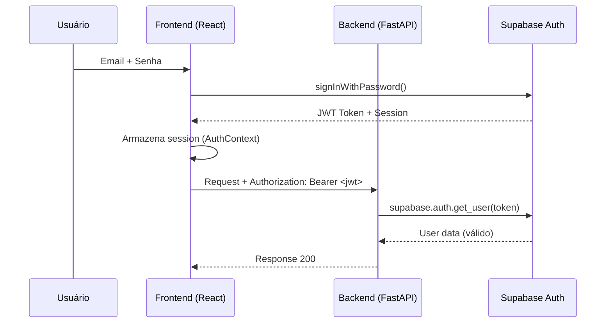
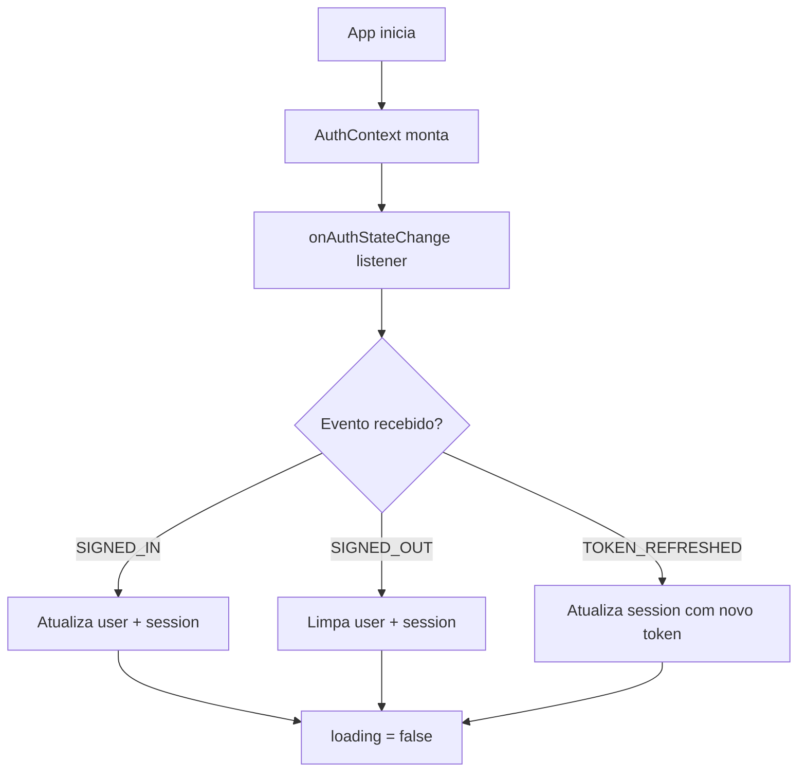
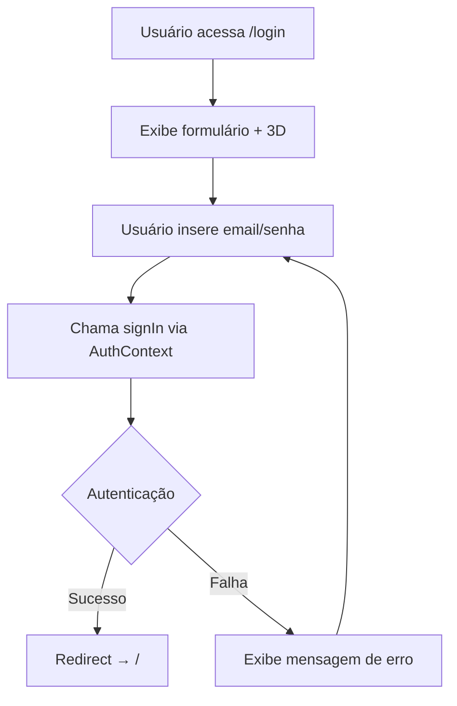
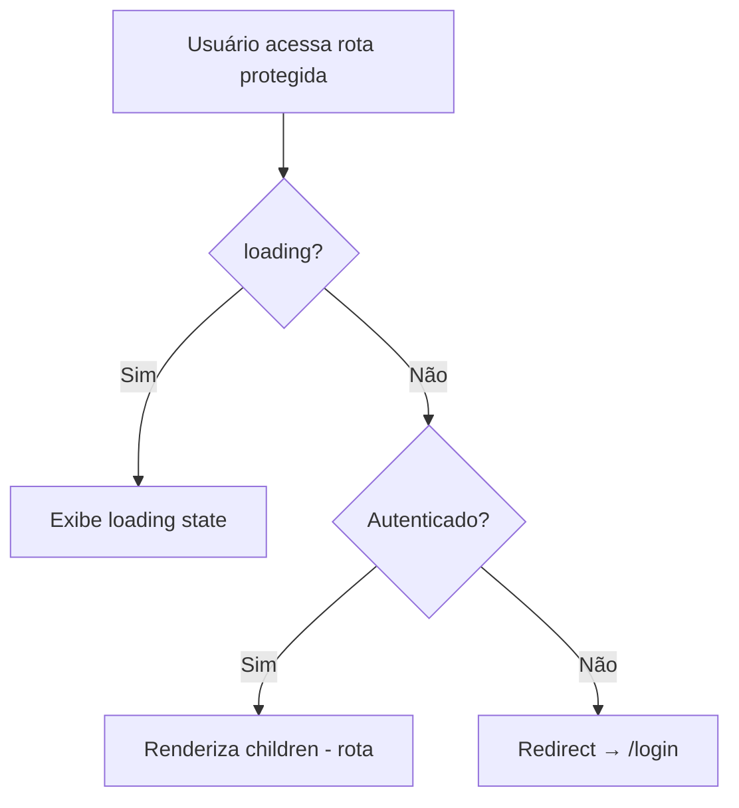
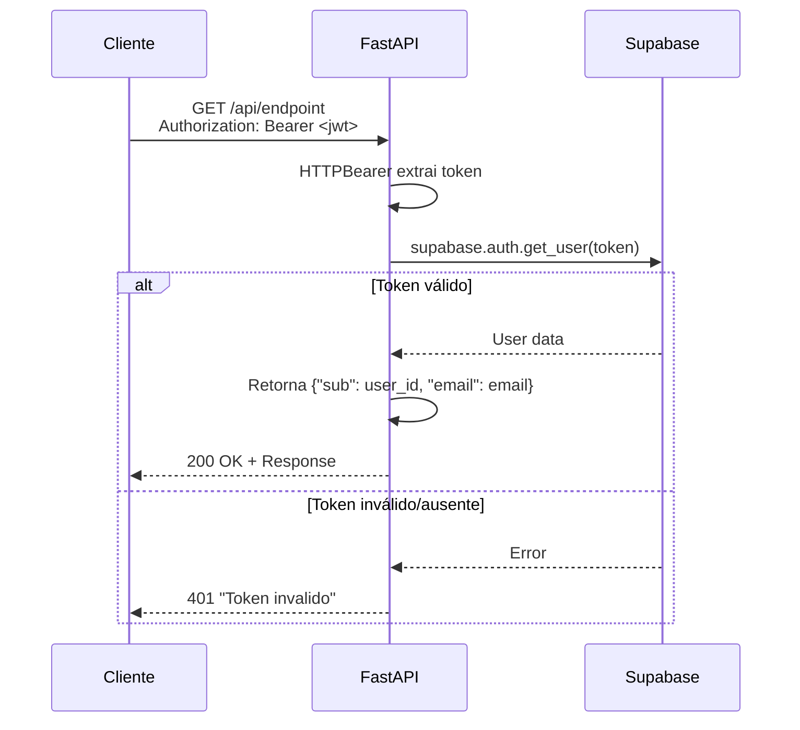
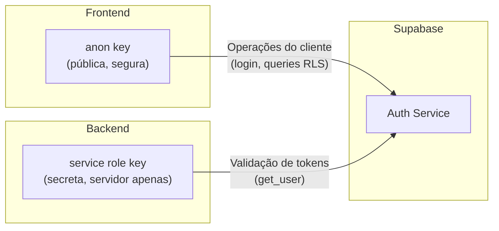

# 🔐 Autenticação e Segurança

## Visão Geral

O módulo de **Autenticação e Segurança** do Horus Parfum Control implementa autenticação via **Supabase Auth** com tokens JWT Bearer, validados tanto no frontend quanto no backend. O sistema foi projetado para um cenário de uso interno com poucos usuários (3-4 pessoas — proprietários e operadores).

### Características Principais

| Aspecto | Implementação |
|---------|---------------|
| Provedor de autenticação | Supabase Auth |
| Tipo de token | JWT Bearer |
| Autorização baseada em papéis | ❌ Não implementada |
| Nível de acesso | Todos os usuários autenticados têm acesso igual |
| Número de usuários | 3-4 (proprietários + operadores) |



> [!NOTE]
> A ausência de autorização baseada em papéis (RBAC) é uma decisão consciente. Com apenas 3-4 usuários internos de confiança, a complexidade adicional de um sistema de permissões não se justifica.

---

## Frontend

### 🔑 AuthContext (`src/contexts/AuthContext.tsx`)

Contexto React que gerencia o estado de autenticação em toda a aplicação.

#### Valores Fornecidos

| Propriedade | Tipo | Descrição |
|-------------|------|-----------|
| `user` | `User \| null` | Objeto do usuário autenticado (ou `null`) |
| `session` | `Session \| null` | Sessão ativa do Supabase |
| `loading` | `boolean` | Indica se a verificação de autenticação está em andamento |
| `signIn` | `function` | Função para login (email/senha) |
| `signOut` | `function` | Função para logout |

#### Funcionamento Interno



- Utiliza o listener `onAuthStateChange` do Supabase JS Client
- A **sessão é armazenada em memória** — o Supabase gerencia a persistência automaticamente (localStorage)
- O **refresh de token** é tratado automaticamente pelo Supabase SDK

> [!TIP]
> O `onAuthStateChange` garante que o estado de autenticação esteja sempre sincronizado, mesmo quando o token é renovado automaticamente pelo Supabase em background.

---

### 🖥️ Página de Login (`/login`)

Página de autenticação com experiência visual diferenciada.

#### Elementos Visuais

| Elemento | Tecnologia | Descrição |
|----------|-----------|-----------|
| Formulário de login | React | Email/senha com validação |
| Modelo 3D | Three.js | Visualizador de frasco de perfume |
| Fundo animado | Three.js (ColorBends) | Background com gradientes animados |

#### Fluxo de Login



#### Campos do Formulário

| Campo | Tipo | Validação |
|-------|------|-----------|
| Email | Input email | Formato de email válido |
| Senha | Input password | Campo obrigatório |

---

### 🛡️ ProtectedRoute (`src/components/shared/ProtectedRoute.tsx`)

Componente wrapper que protege todas as rotas da aplicação, exceto `/login`.

#### Comportamento



| Estado | Comportamento |
|--------|---------------|
| `loading = true` | Exibe indicador de carregamento |
| `user = null` | Redireciona para `/login` |
| `user ≠ null` | Renderiza o conteúdo da rota |

> [!IMPORTANT]
> **Todas as rotas** da aplicação (exceto `/login`) são envolvidas pelo `ProtectedRoute`. Não é possível acessar nenhuma funcionalidade do sistema sem estar autenticado.

---

## Backend

### 🔒 Auth Dependency (`app/auth/deps.py`)

Dependência FastAPI que valida o token JWT em todas as requisições ao backend.

#### Função `get_current_user()`

```python
# Fluxo de validação
async def get_current_user(credentials = Depends(HTTPBearer())):
    token = credentials.credentials
    user = supabase.auth.get_user(token)  # Valida com service role key
    return {"sub": user.id, "email": user.email}
```

#### Fluxo Detalhado



#### Cobertura

| Endpoint | Requer autenticação |
|----------|:-------------------:|
| `GET /api/health` | ❌ |
| Todos os outros endpoints | ✅ |

> [!WARNING]
> O endpoint `/api/health` é o **único** que não requer autenticação. Todos os demais endpoints da API retornam HTTP 401 se o token não for fornecido ou for inválido.

---

### 🗄️ Supabase RLS (Row Level Security)

As políticas de Row Level Security (RLS) do Supabase são configuradas de forma simples, concedendo acesso total a todos os usuários autenticados.

#### Política Aplicada

```sql
-- Política padrão para todas as tabelas
CREATE POLICY "Acesso total para usuários autenticados"
ON <tabela>
FOR ALL
TO authenticated
USING (true)
WITH CHECK (true);
```

| Aspecto | Configuração |
|---------|-------------|
| Alvo | `TO authenticated` |
| Leitura (SELECT) | `USING (true)` — permitido |
| Escrita (INSERT/UPDATE/DELETE) | `WITH CHECK (true)` — permitido |
| Usuários anônimos | Sem acesso |

> [!NOTE]
> Esta configuração é adequada para o cenário do Horus Parfum Control (3-4 usuários internos de confiança). Em caso de expansão do número de usuários ou necessidade de segregação de acesso, será necessário implementar políticas RLS mais granulares.

---

## Segurança

### Medidas Implementadas

| Medida | Descrição | Status |
|--------|-----------|:------:|
| Validação JWT | Token validado em toda requisição ao backend | ✅ |
| CORS restrito | Apenas URL do frontend permitida | ✅ |
| Service role key isolada | Chave de serviço usada apenas no backend | ✅ |
| Anon key no frontend | Frontend usa apenas chave anônima (segura para client-side) | ✅ |
| Hardening de segurança | Melhorias implementadas na Sessão 37 | ✅ |

### Chaves e Tokens



| Chave | Localização | Exposição | Uso |
|-------|------------|-----------|-----|
| `SUPABASE_ANON_KEY` | Frontend | Pública (client-side) | Operações de autenticação e queries com RLS |
| `SUPABASE_SERVICE_ROLE_KEY` | Backend | Secreta (servidor) | Validação de tokens JWT e operações administrativas |

> [!WARNING]
> A **service role key** tem acesso irrestrito ao banco de dados, ignorando todas as políticas RLS. Ela **nunca** deve ser exposta no frontend ou em logs. Essa chave é utilizada exclusivamente no backend (FastAPI) para validar tokens dos usuários.

### CORS (Cross-Origin Resource Sharing)

O backend FastAPI restringe requisições cross-origin apenas à URL do frontend:

```python
# Configuração CORS
app.add_middleware(
    CORSMiddleware,
    allow_origins=[FRONTEND_URL],  # Apenas o frontend
    allow_credentials=True,
    allow_methods=["*"],
    allow_headers=["*"],
)
```

---

## Documentos Relacionados

- [[ARQUITETURA]] — Visão geral da arquitetura e como autenticação se integra
- [[BANCO]] — Políticas RLS aplicadas nas tabelas do banco de dados
- [[DEPLOY]] — Configuração de variáveis de ambiente (chaves Supabase)
- [[REGRAS_NEGOCIO]] — Regras de acesso e permissões do sistema
