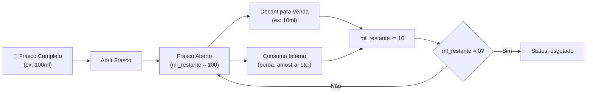
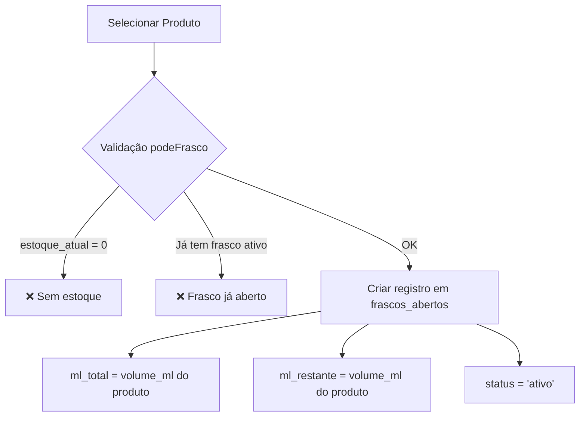

# 🧪 Decants

## Visão Geral

O módulo de **Decants** gerencia o fracionamento de frascos de perfume em porções menores — um conceito-chave na perfumaria artesanal. O modelo de negócio consiste em comprar frascos completos e vender em quantidades fracionadas (decants), maximizando a margem de lucro.

### Conceito



### Tipos de Consumo

O sistema diferencia entre dois tipos de uso de decants:

| Tipo | Faturável | Módulo |
|------|:---------:|--------|
| **Venda** | ✅ | [[features/VENDAS]] |
| **Consumo interno** | ❌ | Este módulo (Decants) |

#### Classificações de Consumo Interno (Não-Faturável)

| Classificação | Código | Descrição |
|---------------|--------|-----------|
| Perda | `perda` | Produto perdido (derramamento, evaporação, etc.) |
| Amostra | `amostra` | Amostra para cliente experimentar |
| Brinde | `brinde` | Brinde oferecido ao cliente |
| Marketing | `marketing` | Uso em ações de marketing e divulgação |
| Uso interno | `uso_interno` | Uso pessoal ou teste interno |

> [!IMPORTANT]
> Os decants para **venda** não são registrados neste módulo. Eles são gerenciados pelo módulo de [[features/VENDAS]], que cria `venda_item` com `tipo='decant'` e desconta o `ml_restante` do frasco automaticamente.

---

## Funcionalidades

### 🍶 Gestão de Decants (`/estoque/decants`)

A tela principal exibe os frascos abertos em formato de **cards**, proporcionando uma visão rápida e visual do status de cada frasco.

#### Informações do Card

| Elemento | Descrição |
|----------|-----------|
| Nome do produto | Nome do perfume / produto |
| Barra de progresso | `ml_restante / ml_total` — indica visualmente quanto resta |
| FrascoViewer 3D | Visualização 3D do frasco com nível de líquido proporcional |

#### FrascoViewer (Visualização 3D)

Componente de visualização 3D renderizado com **Three.js** que exibe um frasco de perfume com o nível de líquido proporcional ao `ml_restante`. Oferece feedback visual imediato sobre a quantidade restante em cada frasco.

> [!TIP]
> O FrascoViewer é um diferencial visual do sistema. O nível do líquido no frasco 3D se ajusta automaticamente conforme decants são registrados, proporcionando uma experiência intuitiva ao operador.

---

### 🆕 Abrir Frasco (`AbrirFrascoModal`)

Modal para abertura de um novo frasco de perfume.

#### Fluxo



#### Validações (`lib/decants.ts` → `podeFrasco`)

| Regra | Condição | Erro |
|-------|----------|------|
| Estoque disponível | `produto.estoque_atual > 0` | Produto sem estoque |
| Frasco único | Não pode existir frasco `ativo` para o mesmo produto | Produto já possui frasco aberto |

#### Registro Criado

```
frascos_abertos:
  produto_id: <id do produto selecionado>
  ml_total: <volume_ml do produto>
  ml_restante: <volume_ml do produto>
  status: 'ativo'
```

---

### 💧 Registrar Consumo — `DecantModal`

Modal para registro de consumo interno (não-faturável) de um frasco aberto.

#### Campos do Formulário

| Campo | Tipo | Obrigatório | Descrição |
|-------|------|:-----------:|-----------|
| ML | Numérico | ✅ | Quantidade em mililitros a consumir |
| Classificação | Select | ✅ | Tipo de consumo (perda, amostra, brinde, marketing, uso_interno) |
| Custo embalagem | Moeda (R$) | ❌ | Custo da embalagem utilizada |

#### Operação — RPC `registrar_consumo_decant`

```
registrar_consumo_decant(
  p_frasco_id,
  p_ml,
  p_classificacao,
  p_custo_embalagem,
  p_responsavel
)
```

A RPC executa atomicamente:

1. **Cria registro** na tabela `decants` com os dados do consumo
2. **Atualiza `ml_restante`** do frasco (`ml_restante -= p_ml`)
3. **Cria transação de despesa** no módulo financeiro (custo do perfume + embalagem)

#### Validação — `calcularNovoML`

```typescript
calcularNovoML(mlRestante, mlDecant):
  resultado = mlRestante - mlDecant
  if resultado < 0 → retorna null (inválido)
  return resultado
```

> [!WARNING]
> Não é possível registrar um consumo maior que o `ml_restante` do frasco. O sistema valida e bloqueia a operação, retornando `null` via `calcularNovoML`.

---

### 🔴 Esgotar Frasco

Quando o `ml_restante` de um frasco chega a **0**, o sistema automaticamente marca o status como `esgotado`.

| Ação | Descrição |
|------|-----------|
| Esgotamento automático | Status muda para `esgotado` quando `ml_restante = 0` |
| Exclusão | Opção de deletar o registro do frasco esgotado |

---

### 📊 Resumo de Consumo

Visão agregada dos consumos internos (não-faturáveis) por período, útil para entender o uso de estoque que não gera receita.

#### Função `resumoConsumo` (`lib/decants.ts`)

```typescript
resumoConsumo(decants, inicio, fim):
  // Filtra decants pelo período [inicio, fim]
  // Agrupa por classificação
  // Soma os custos de cada grupo
  // Retorna objeto com totais por classificação
```

#### Exemplo de Saída

| Classificação | Custo Total |
|---------------|-------------|
| `perda` | R$ 150,00 |
| `amostra` | R$ 320,00 |
| `brinde` | R$ 85,00 |
| `marketing` | R$ 200,00 |
| `uso_interno` | R$ 45,00 |
| **Total** | **R$ 800,00** |

> [!NOTE]
> O resumo de consumo é essencial para o controle financeiro, pois ajuda a identificar quanto do estoque está sendo utilizado em atividades que não geram receita direta. Perdas excessivas, por exemplo, podem indicar problemas no manuseio.

---

## Lógica de Negócio (`lib/decants.ts`)

### Funções Exportadas

#### `podeFrasco(produto)`

Verifica se um produto pode ter um novo frasco aberto.

| Condição | Resultado |
|----------|-----------|
| `estoque_atual > 0` AND sem frasco `ativo` | `true` — pode abrir |
| `estoque_atual = 0` | `false` — sem estoque |
| Já tem frasco `ativo` | `false` — já possui frasco aberto |

#### `calcularNovoML(mlRestante, mlDecant)`

Calcula o ML restante após um decant.

- **Retorno**: `mlRestante - mlDecant` se resultado ≥ 0
- **Retorno**: `null` se resultado < 0 (operação inválida)

#### `statusAposDecant(mlRestante, mlDecant)`

Determina o novo status do frasco após um decant.

- Se `mlRestante - mlDecant = 0` → `'esgotado'`
- Se `mlRestante - mlDecant > 0` → `'ativo'`

#### `resumoConsumo(decants, inicio, fim)`

Agrega custos de decants por classificação dentro de um período.

- **Entrada**: Lista de decants, data início, data fim
- **Saída**: Objeto com custo total por classificação

---

## Decants em Vendas

Quando um decant é vendido ao cliente (via módulo [[features/VENDAS]]), o fluxo é diferente do consumo interno:

### Cálculo do Custo Unitário do Decant

```
custoDecantUnitario = (ml × custoMedio) / volumeMl
```

Onde:
- `ml` = quantidade em mililitros do decant vendido
- `custoMedio` = custo médio do produto (calculado pelo módulo de [[features/PEDIDOS]])
- `volumeMl` = volume total do frasco original

### Impacto no Sistema

| Operação | Detalhe |
|----------|---------|
| `ml_restante` do frasco | Reduzido pela quantidade vendida |
| `venda_item` | Criado com `tipo='decant'` |
| Receita | Registrada no módulo [[features/FINANCEIRO]] |

---

## Tabelas do Banco de Dados

### `frascos_abertos`

| Coluna | Tipo | Nullable | Descrição |
|--------|------|:--------:|-----------|
| `id` | UUID | ❌ | Chave primária |
| `produto_id` | UUID (FK) | ❌ | Referência ao produto |
| `ml_total` | Decimal | ❌ | Volume total do frasco (= `volume_ml` do produto) |
| `ml_restante` | Decimal | ❌ | Volume restante no frasco |
| `status` | Enum | ❌ | `ativo` ou `esgotado` |
| `created_at` | Timestamp | ❌ | Data de abertura do frasco |

### `decants`

| Coluna | Tipo | Nullable | Descrição |
|--------|------|:--------:|-----------|
| `id` | UUID | ❌ | Chave primária |
| `frasco_id` | UUID (FK) | ❌ | Referência ao frasco aberto |
| `produto_id` | UUID (FK) | ❌ | Referência ao produto |
| `ml` | Decimal | ❌ | Quantidade em mililitros consumida |
| `classificacao` | Enum | ❌ | perda, amostra, brinde, marketing, uso_interno |
| `custo` | Decimal | ❌ | Custo do perfume consumido |
| `custo_embalagem` | Decimal | ✅ | Custo da embalagem utilizada |
| `created_at` | Timestamp | ❌ | Data do registro |

### `embalagens_decant`

| Coluna | Tipo | Nullable | Descrição |
|--------|------|:--------:|-----------|
| `id` | UUID | ❌ | Chave primária |
| `tamanho_ml` | Decimal | ❌ | Tamanho da embalagem em mililitros |
| `custo` | Decimal | ❌ | Custo unitário da embalagem |
| `ativo` | Boolean | ❌ | Se a embalagem está disponível para uso |

---

## RPCs (Remote Procedure Calls)

### `registrar_consumo_decant`

Operação atômica que registra um consumo interno de decant.

| Aspecto | Detalhe |
|---------|---------|
| **Nome** | `registrar_consumo_decant` |
| **Tipo** | RPC Supabase (PostgreSQL function) |
| **Transacional** | Sim — tudo ou nada |

#### Parâmetros

| Parâmetro | Tipo | Descrição |
|-----------|------|-----------|
| `p_frasco_id` | UUID | ID do frasco aberto |
| `p_ml` | Decimal | Quantidade em mililitros |
| `p_classificacao` | Text | Classificação do consumo |
| `p_custo_embalagem` | Decimal | Custo da embalagem (opcional) |
| `p_responsavel` | Text | Usuário responsável |

#### Operações Executadas

1. Cria registro na tabela `decants`
2. Atualiza `frascos_abertos.ml_restante` (subtrai `p_ml`)
3. Se `ml_restante = 0`, atualiza status para `esgotado`
4. Cria transação de despesa no módulo financeiro

---

## Documentos Relacionados

- [[features/ESTOQUE]] — Integração com estoque (abertura de frascos consome estoque)
- [[features/VENDAS]] — Vendas de decants aos clientes
- [[features/FINANCEIRO]] — Registro de despesas de consumo interno
- [[BANCO]] — Estrutura das tabelas de frascos, decants e embalagens
- [[REGRAS_NEGOCIO]] — Regras de fracionamento e custo unitário
- [[GLOSSARIO]] — Definições de termos como decant, frasco, classificação
