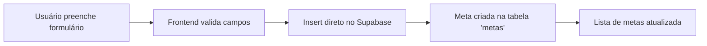
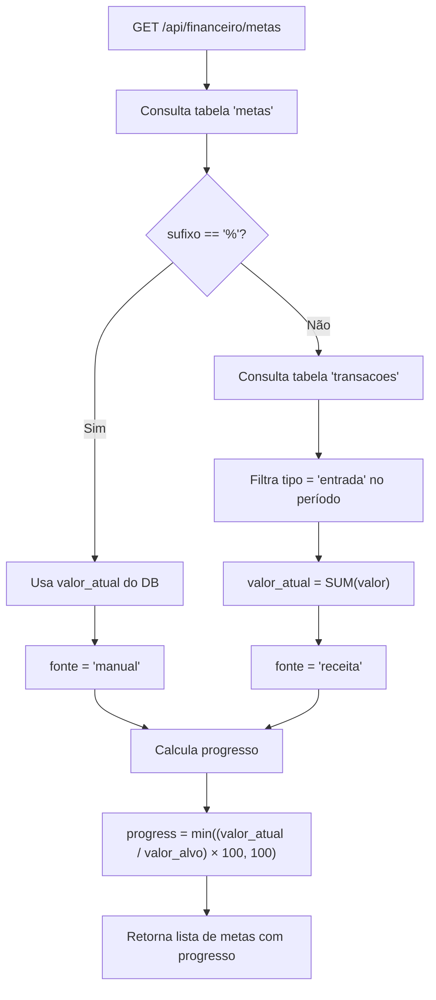

# 🎯 Metas Financeiras

> [!NOTE]
> Documentação completa da funcionalidade de metas financeiras do sistema Horus Parfum Control — criação, acompanhamento e cálculo automático de progresso.

---

## Visão Geral

O módulo de **Metas Financeiras** permite ao usuário definir objetivos financeiros com acompanhamento visual de progresso. O sistema suporta:

- **Metas monetárias** (ex: "Faturar R$ 10.000 em junho") — progresso calculado **automaticamente** pelo backend com base nas transações.
- **Metas percentuais** (ex: "Margem de lucro de 30%") — progresso atualizado **manualmente** pelo usuário.

| Aspecto | Detalhe |
|---------|---------|
| **Rota** | `/financeiro/metas` |
| **Cálculo** | Backend (Python) com precisão `Decimal` |
| **API** | `GET /api/financeiro/metas` |
| **Service** | `financeiro_metas.py` |
| **Tabelas** | `metas`, `transacoes` |

> [!IMPORTANT]
> O cálculo automático de progresso só se aplica a metas monetárias (`sufixo != '%'`). Metas percentuais utilizam o `valor_atual` armazenado diretamente no banco, que deve ser atualizado manualmente pelo usuário.

---

## Funcionalidades (`/financeiro/metas`)

### Criar Meta

Para criar uma nova meta, o usuário preenche os seguintes campos:

| Campo | Tipo | Obrigatório | Descrição |
|-------|------|:-----------:|-----------|
| `label` | `string` | ✅ | Nome descritivo da meta (ex: "Faturamento Mensal") |
| `valor_alvo` | `Decimal` | ✅ | Valor-alvo a ser atingido (ex: `10000.00`) |
| `sufixo` | `string` | ✅ | Unidade/sufixo exibido. Vazio `''` para monetário, `'%'` para percentual |
| `periodo` | `string` | ✅ | Período da meta (ver formatos abaixo) |

A criação é realizada via **inserção direta no Supabase** (client-side), sem passar pela API backend.



#### Formatos de Período

O campo `periodo` suporta três formatos:

| Formato | Exemplo | Descrição | Intervalo de Datas |
|---------|---------|-----------|-------------------|
| `YYYY-MM` | `2025-06` | Mensal | 1º ao último dia do mês |
| `YYYY` | `2025` | Anual | 1º de janeiro a 31 de dezembro |
| `YYYY-QN` | `2025-Q2` | Trimestral | Primeiro ao último dia do trimestre |

**Mapeamento de trimestres:**

| Trimestre | Meses | Início | Fim |
|-----------|-------|--------|-----|
| Q1 | Janeiro — Março | 01/jan | 31/mar |
| Q2 | Abril — Junho | 01/abr | 30/jun |
| Q3 | Julho — Setembro | 01/jul | 30/set |
| Q4 | Outubro — Dezembro | 01/out | 31/dez |

---

### Visualização

As metas são exibidas como **cards com barra de progresso**, mostrando o avanço em direção ao objetivo.

#### Barra de Progresso

- Exibe a razão `valor_atual / valor_alvo` como porcentagem.
- O progresso é **limitado a 100%** visualmente, mesmo que o valor atual ultrapasse o alvo.
- A cor da barra varia conforme o nível de progresso:

| Faixa de Progresso | Cor | Indicação |
|--------------------|-----|-----------|
| 0% — 33% | 🔴 Vermelho | Baixo progresso |
| 34% — 66% | 🟡 Amarelo | Progresso moderado |
| 67% — 100% | 🟢 Verde | Bom progresso |

#### Informações Exibidas no Card

- **Label** da meta (nome descritivo)
- **Valor atual** / **Valor alvo** (com sufixo)
- **Barra de progresso** colorida
- **Período** da meta
- **Fonte** do valor (`receita` ou `manual`)

---

### Cálculo Automático (Backend)

O backend é responsável por calcular automaticamente o progresso das metas monetárias. Este cálculo ocorre **a cada requisição** à API de metas.

#### Endpoint

```
GET /api/financeiro/metas
```

#### Service: `financeiro_metas.py`

#### Fluxo de Cálculo



#### Lógica Detalhada

Para cada meta retornada pela consulta ao banco:

**1. Metas Monetárias** (`sufixo != '%'`):

```python
# Pseudo-código do cálculo
periodo_inicio, periodo_fim = parse_periodo(meta.periodo)

valor_atual = (
    transacoes
    .filter(tipo='entrada')
    .filter(data__gte=periodo_inicio)
    .filter(data__lte=periodo_fim)
    .aggregate(Sum('valor'))
)

meta.valor_atual = valor_atual
meta.fonte = 'receita'
```

- O sistema consulta a tabela `transacoes`.
- Filtra transações do tipo `entrada` que caem dentro do período da meta.
- Soma todos os valores com precisão `Decimal`.
- Atualiza `valor_atual` com o total calculado.
- Define `fonte = 'receita'` para indicar que o valor foi auto-calculado.

**2. Metas Percentuais** (`sufixo == '%'`):

```python
# Pseudo-código
meta.valor_atual = meta.valor_atual  # Usa valor do banco, sem alteração
meta.fonte = 'manual'
```

- O `valor_atual` armazenado no banco de dados é utilizado **sem modificação**.
- O usuário é responsável por atualizar esse valor manualmente.
- Define `fonte = 'manual'` para indicar que o valor não é auto-calculado.

**3. Cálculo de Progresso** (ambos os tipos):

```python
progress = min((valor_atual / valor_alvo) * 100, 100)
```

- O progresso é calculado como a porcentagem do valor atual em relação ao alvo.
- O valor é **limitado a 100** (cap), mesmo que `valor_atual > valor_alvo`.

> [!WARNING]
> O cálculo automático soma **todas** as transações de entrada no período, independentemente da categoria ou origem. Se o usuário deseja metas por categoria específica, deve usar metas percentuais com atualização manual.

---

### Parsing de Período

A função de parsing converte o campo `periodo` em um intervalo de datas (`inicio`, `fim`) para filtrar transações:

| Formato | Entrada | `inicio` | `fim` |
|---------|---------|----------|-------|
| `YYYY-MM` | `2025-06` | `2025-06-01` | `2025-06-30` |
| `YYYY` | `2025` | `2025-01-01` | `2025-12-31` |
| `YYYY-QN` | `2025-Q2` | `2025-04-01` | `2025-06-30` |

```python
def parse_periodo(periodo: str) -> tuple[date, date]:
    if re.match(r'^\d{4}-Q[1-4]$', periodo):
        ano, trimestre = periodo.split('-Q')
        # Mapeia trimestre para meses
        ...
    elif re.match(r'^\d{4}-\d{2}$', periodo):
        # Mensal: primeiro e último dia do mês
        ...
    elif re.match(r'^\d{4}$', periodo):
        # Anual: 1/jan a 31/dez
        ...
```

> [!TIP]
> O formato `YYYY-QN` é particularmente útil para metas trimestrais de faturamento, permitindo acompanhar a performance comercial por quarter.

---

## Tabelas do Banco de Dados

### Tabela `metas`

| Coluna | Tipo | Nullable | Descrição |
|--------|------|:--------:|-----------|
| `id` | `uuid` | ❌ | Identificador único (PK) |
| `label` | `text` | ❌ | Nome descritivo da meta |
| `valor_atual` | `numeric` | ✅ | Valor atual (usado para metas percentuais) |
| `valor_alvo` | `numeric` | ❌ | Valor-alvo a atingir |
| `sufixo` | `text` | ❌ | Sufixo/unidade (`''` = monetário, `'%'` = percentual) |
| `periodo` | `text` | ❌ | Período da meta (`YYYY-MM`, `YYYY`, `YYYY-QN`) |
| `created_at` | `timestamptz` | ❌ | Data de criação (default: `now()`) |

### Tabela `transacoes` (referência)

A tabela `transacoes` é consultada pelo serviço de metas para cálculo automático. Documentação completa em [[BANCO]].

Campos relevantes para o cálculo de metas:

| Coluna | Uso no cálculo de metas |
|--------|------------------------|
| `tipo` | Filtro: apenas `'entrada'` |
| `valor` | Somado para `valor_atual` |
| `data` | Filtrado pelo período da meta |

---

## Exemplo de Resposta da API

```json
[
  {
    "id": "a1b2c3d4-...",
    "label": "Faturamento Junho",
    "valor_atual": 7500.00,
    "valor_alvo": 10000.00,
    "sufixo": "",
    "periodo": "2025-06",
    "fonte": "receita",
    "progress": 75.0,
    "created_at": "2025-06-01T00:00:00Z"
  },
  {
    "id": "e5f6g7h8-...",
    "label": "Margem de Lucro",
    "valor_atual": 28.5,
    "valor_alvo": 35.0,
    "sufixo": "%",
    "periodo": "2025-Q2",
    "fonte": "manual",
    "progress": 81.43,
    "created_at": "2025-04-01T00:00:00Z"
  }
]
```

---

## Documentos Relacionados

- [[features/FINANCEIRO]] — Módulo financeiro (transações utilizadas no cálculo automático)
- [[features/RELATORIOS]] — Relatórios financeiros e de estoque
- [[API]] — Documentação completa da API backend
- [[BANCO]] — Esquema do banco de dados (tabelas `metas` e `transacoes`)
- [[REGRAS_NEGOCIO]] — Regras de negócio do sistema
