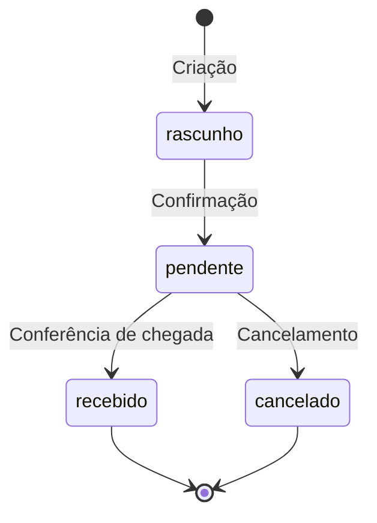
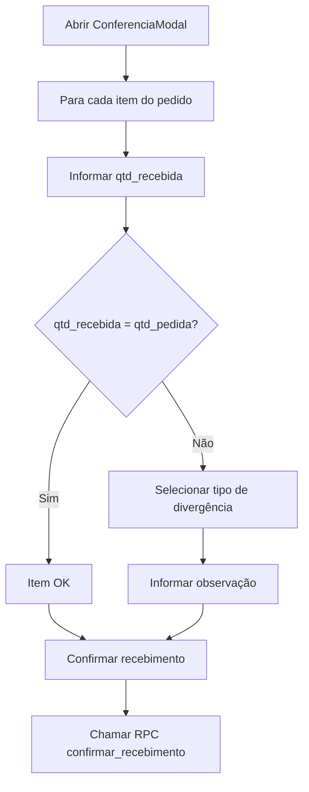

# 📦 Pedidos de Compra

## Visão Geral

O módulo de **Pedidos de Compra** gerencia todo o ciclo de vida das ordens de compra com fornecedores no Horus Parfum Control. Desde a criação do pedido até o recebimento e conferência dos produtos, o sistema rastreia divergências entre quantidades pedidas e recebidas, garantindo controle rigoroso sobre a entrada de mercadorias no estoque.

### Ciclo de Vida do Pedido



| Status | Descrição |
|--------|-----------|
| `rascunho` | Pedido criado mas ainda não confirmado |
| `pendente` | Pedido confirmado, aguardando chegada do fornecedor |
| `recebido` | Mercadoria recebida e conferida |
| `cancelado` | Pedido cancelado antes do recebimento |

> [!IMPORTANT]
> O recebimento de um pedido é uma **operação atômica** — atualiza status, cria movimentações de estoque, recalcula custo médio e registra divergências, tudo em uma única transação via RPC.

---

## Funcionalidades

### 📋 Lista de Pedidos (`/estoque/pedidos`)

Tela principal do módulo, exibindo todos os pedidos de compra em formato de tabela.

#### Colunas da Tabela

| Coluna | Tipo | Descrição |
|--------|------|-----------|
| `numero` | Serial | Número sequencial do pedido (gerado automaticamente) |
| `fornecedor` | Texto | Nome do fornecedor associado |
| `status` | Badge | Status atual do pedido (rascunho, pendente, recebido, cancelado) |
| `previsao_chegada` | Data | Data estimada de chegada da mercadoria |
| `valor_total` | Moeda (R$) | Valor total do pedido incluindo frete |
| `frete` | Moeda (R$) | Valor do frete (funcionalidade da Sessão 39) |
| `responsavel` | Texto | Usuário responsável pelo pedido |

#### Ações Disponíveis

- **Novo Pedido** — Abre o `NovoPedidoModal` para criação
- **Editar** — Permite edição de pedidos com status `pendente` (funcionalidade da Sessão 6)
- **Cancelar** — Cancela pedidos que ainda não foram recebidos
- **Confirmar Chegada** — Aciona o `ConferenciaModal` para conferência de mercadoria

---

### 🆕 Novo Pedido Modal

Modal de criação de pedidos de compra (~17KB — formulário extenso com múltiplas validações).

#### Campos do Formulário

| Campo | Tipo | Obrigatório | Descrição |
|-------|------|:-----------:|-----------|
| Fornecedor | Select | ✅ | Seleção do fornecedor cadastrado |
| Itens do Pedido | Lista dinâmica | ✅ | Produtos com quantidade e preço |
| Frete | Numérico (R$) | ❌ | Valor do frete (padrão: R$ 0,00) |

#### Adição de Itens

Para cada item adicionado ao pedido:

| Campo | Tipo | Descrição |
|-------|------|-----------|
| Produto | Select | Produto do catálogo |
| `qtd_pedida` | Inteiro | Quantidade solicitada ao fornecedor |
| `preco_unitario` | Moeda (R$) | Preço unitário negociado |

#### Cálculo do Total

```
valor_total = Σ(qtd_pedida × preco_unitario) + frete
```

#### Preview do Custo Médio Ponderado

O modal exibe uma prévia do novo custo médio de cada produto após o recebimento, usando a fórmula de média ponderada:

```
novoCustoMedio = (estoque_atual × custo_medio_atual + qtd_recebida × preco_unitario)
                 ÷ (estoque_atual + qtd_recebida)
```

> [!TIP]
> A prévia do custo médio ajuda o operador a avaliar o impacto da compra no custo dos produtos antes de confirmar o pedido.

---

### ✅ Conferência Modal (`ConferenciaModal`)

Modal de conferência de mercadoria recebida. Acionado pelo botão "Confirmar Chegada" na lista de pedidos.

#### Fluxo de Conferência



#### Campos por Item

| Campo | Tipo | Validação |
|-------|------|-----------|
| `qtd_recebida` | Inteiro | ≥ 0, somente inteiros |
| Tipo de divergência | Select | Obrigatório se `qtd_recebida ≠ qtd_pedida` |
| Observação | Texto | Opcional |

#### Validações

- **Quantidades negativas** não são permitidas
- Somente **números inteiros** são aceitos
- Se `qtd_recebida ≠ qtd_pedida`, o **tipo de divergência** é obrigatório

#### Operação Atômica (RPC `confirmar_recebimento`)

Ao confirmar o recebimento, o sistema executa via RPC uma operação atômica que:

1. **Atualiza o status** do pedido para `recebido`
2. **Cria movimentações de estoque** (entradas) para cada item recebido
3. **Recalcula o custo médio** ponderado de cada produto
4. **Registra divergências** encontradas na conferência

> [!WARNING]
> A conferência é uma operação irreversível. Uma vez confirmado o recebimento, o pedido não pode retornar ao status `pendente`. Verifique todas as quantidades antes de confirmar.

---

### ⚠️ Divergências (`/estoque/pedidos/divergencias`)

Tela dedicada ao acompanhamento de divergências encontradas durante as conferências de recebimento.

#### Colunas da Tabela

| Coluna | Tipo | Descrição |
|--------|------|-----------|
| `pedido` | Referência | Número do pedido relacionado |
| `fornecedor` | Texto | Fornecedor do pedido |
| `produto` | Texto | Produto com divergência |
| `tipo` | Badge | Tipo da divergência |
| `qtd_pedida` | Inteiro | Quantidade originalmente pedida |
| `qtd_recebida` | Inteiro | Quantidade efetivamente recebida |
| `observacao` | Texto | Observação registrada na conferência |

#### Tipos de Divergência

| Tipo | Código | Descrição |
|------|--------|-----------|
| Faltou | `faltou` | Quantidade recebida menor que a pedida |
| Veio a mais | `veio_a_mais` | Quantidade recebida maior que a pedida |
| Avariado | `avariado` | Produto chegou danificado |
| Produto errado | `produto_errado` | Produto diferente do solicitado |

#### Resumo por Fornecedor

A tela oferece um resumo agregado de divergências por fornecedor, útil para avaliar a confiabilidade de cada parceiro comercial.

---

### 📄 Importação de PDF

Funcionalidade para importação automatizada de pedidos a partir de notas fiscais ou orçamentos em PDF.

#### Backend — `POST /api/estoque/pedidos/importar-pdf`

| Aspecto | Detalhe |
|---------|---------|
| Endpoint | `POST /api/estoque/pedidos/importar-pdf` |
| Tamanho máximo | 10 MB |
| Validação | Content-Type + magic bytes do arquivo |
| Extração | `pypdf` para extração de texto |
| Parser | Regex para extrair dados estruturados |

##### Dados Extraídos

- Nome do produto
- Quantidade
- Preço unitário
- Total do item

#### Frontend — Fuzzy Matching (`lib/pedidoPdfImport.ts`)

O frontend realiza correspondência aproximada (fuzzy matching) entre os itens extraídos do PDF e os produtos cadastrados no sistema.

##### Algoritmo de Matching

```
1. Normalização dos nomes:
   - Remove acentos
   - Converte para lowercase

2. Tokenização:
   - Divide o nome em tokens (palavras)

3. Cálculo de similaridade:
   - Coeficiente de Dice entre os conjuntos de tokens

4. Classificação do match:
   - Score ≥ 0.78 → Match confirmado
   - Diferença entre 1º e 2º melhor ≤ 0.03 → Match ambíguo (requer revisão manual)
   - Score < 0.78 → Sem match
```

##### Extração de Volume (ML)

O algoritmo também extrai informações de volume em mililitros dos nomes dos produtos para melhorar a filtragem e correspondência.

> [!NOTE]
> O sistema gera **avisos** quando a contagem declarada no PDF difere da contagem de itens efetivamente extraídos, alertando o operador para possíveis falhas na extração.

---

## Lógica de Negócio (`lib/pedidos.ts`)

### Funções Principais

#### `calcularCustoMedio`

Calcula o novo custo médio ponderado após o recebimento de mercadoria.

```typescript
// Fórmula: Média Ponderada
novoCustoMedio = (estoque_atual × custo_medio_atual + qtd_recebida × preco_unitario)
                 ÷ (estoque_atual + qtd_recebida)
```

**Parâmetros:**
- `estoque_atual` — Quantidade atual em estoque
- `custo_medio_atual` — Custo médio atual do produto
- `qtd_recebida` — Quantidade recebida no pedido
- `preco_unitario` — Preço unitário pago no pedido

#### `calcularTotalPedido`

Calcula o valor total do pedido incluindo frete.

```typescript
// Fórmula
total = Σ(item.qtd_pedida × item.preco_unitario) + frete
```

#### `validarConferencia`

Valida os dados da conferência de recebimento.

**Regras de validação:**
- Quantidades não podem ser negativas
- Quantidades devem ser números inteiros
- Se `qtd_recebida ≠ qtd_pedida`, o tipo de divergência é obrigatório

---

## Tabelas do Banco de Dados

### `pedidos`

| Coluna | Tipo | Nullable | Descrição |
|--------|------|:--------:|-----------|
| `id` | UUID | ❌ | Chave primária |
| `numero` | Serial | ❌ | Número sequencial do pedido |
| `fornecedor_id` | UUID (FK) | ❌ | Referência ao fornecedor |
| `status` | Enum | ❌ | rascunho, pendente, recebido, cancelado |
| `previsao_chegada` | Date | ✅ | Data prevista de chegada |
| `valor_total` | Decimal | ❌ | Valor total (itens + frete) |
| `frete` | Decimal | ✅ | Valor do frete |
| `responsavel` | Text | ❌ | Usuário que criou o pedido |
| `recebido_em` | Timestamp | ✅ | Data/hora do recebimento |
| `recebido_por` | Text | ✅ | Usuário que conferiu o recebimento |
| `created_at` | Timestamp | ❌ | Data de criação |

### `pedido_itens`

| Coluna | Tipo | Nullable | Descrição |
|--------|------|:--------:|-----------|
| `id` | UUID | ❌ | Chave primária |
| `pedido_id` | UUID (FK) | ❌ | Referência ao pedido |
| `produto_id` | UUID (FK) | ❌ | Referência ao produto |
| `qtd_pedida` | Integer | ❌ | Quantidade solicitada |
| `qtd_recebida` | Integer | ✅ | Quantidade efetivamente recebida |
| `preco_unitario` | Decimal | ❌ | Preço unitário negociado |

### `divergencias`

| Coluna | Tipo | Nullable | Descrição |
|--------|------|:--------:|-----------|
| `id` | UUID | ❌ | Chave primária |
| `pedido_id` | UUID (FK) | ❌ | Referência ao pedido |
| `pedido_item_id` | UUID (FK) | ❌ | Referência ao item do pedido |
| `fornecedor_id` | UUID (FK) | ❌ | Referência ao fornecedor |
| `tipo` | Enum | ❌ | faltou, veio_a_mais, avariado, produto_errado |
| `qtd_pedida` | Integer | ❌ | Quantidade pedida |
| `qtd_recebida` | Integer | ❌ | Quantidade recebida |
| `observacao` | Text | ✅ | Observação sobre a divergência |
| `created_at` | Timestamp | ❌ | Data de registro |

---

## RPCs (Remote Procedure Calls)

### `confirmar_recebimento`

Operação atômica que processa o recebimento de um pedido de compra.

| Aspecto | Detalhe |
|---------|---------|
| **Nome** | `confirmar_recebimento` |
| **Tipo** | RPC Supabase (PostgreSQL function) |
| **Transacional** | Sim — tudo ou nada |

#### Parâmetros

| Parâmetro | Tipo | Descrição |
|-----------|------|-----------|
| `p_pedido_id` | UUID | ID do pedido a ser recebido |
| `p_itens` | JSONB[] | Array com qtd_recebida e divergências por item |
| `p_recebido_por` | Text | Usuário responsável pela conferência |

#### Operações Executadas

1. Atualiza `pedidos.status` para `recebido`
2. Atualiza `pedidos.recebido_em` e `pedidos.recebido_por`
3. Para cada item:
   - Atualiza `pedido_itens.qtd_recebida`
   - Cria registro em `movimentacoes` (tipo: entrada)
   - Recalcula `produtos.custo_medio` usando média ponderada
   - Atualiza `produtos.estoque_atual`
4. Se há divergência, cria registro na tabela `divergencias`

---

## Documentos Relacionados

- [[features/ESTOQUE]] — Módulo de estoque (movimentações e saldos)
- [[features/FINANCEIRO]] — Impacto financeiro das compras
- [[BANCO]] — Estrutura das tabelas de pedidos, itens e divergências
- [[REGRAS_NEGOCIO]] — Regras de custo médio e validações
- [[API]] — Endpoints de importação de PDF e operações de pedidos
