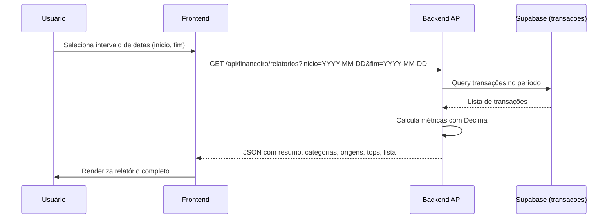
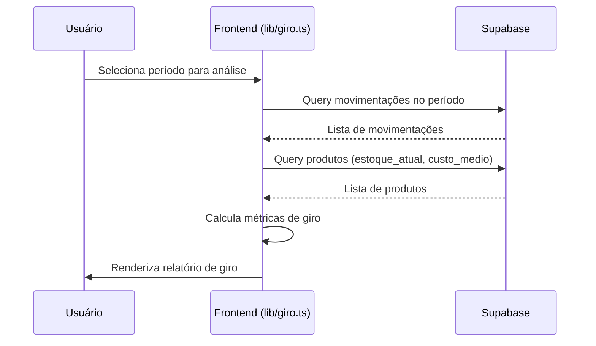

# 📊 Relatórios

> [!NOTE]
> Documentação completa de todas as funcionalidades de relatórios do sistema Horus Parfum Control — relatórios financeiros e relatórios de estoque (giro).

---

## Visão Geral

O Horus Parfum Control oferece **dois tipos de relatórios**:

| Tipo | Rota | Cálculo | Precisão |
|------|------|---------|----------|
| **Relatórios Financeiros** | `/financeiro/relatorios` | Backend (Python) | `Decimal` |
| **Relatórios de Estoque (Giro)** | `/estoque/relatorios` | Frontend (TypeScript) | `number` (JS) |

- **Relatórios Financeiros** são calculados inteiramente no backend para garantir precisão decimal em operações monetárias. O frontend apenas exibe os dados recebidos.
- **Relatórios de Estoque (Giro)** são calculados no frontend, utilizando a biblioteca `lib/giro.ts`, que consulta diretamente o Supabase para obter movimentações e produtos.

---

## 💰 Relatórios Financeiros (`/financeiro/relatorios`)

### Como Funciona

O fluxo completo de geração de um relatório financeiro segue as etapas abaixo:



1. O usuário seleciona um **intervalo de datas** (`inicio` e `fim`) na interface.
2. O frontend faz uma chamada ao backend:
   ```
   GET /api/financeiro/relatorios?inicio=YYYY-MM-DD&fim=YYYY-MM-DD
   ```
3. O backend consulta a tabela `transacoes` no Supabase, filtrando pelo período informado.
4. Todos os cálculos são realizados com **precisão `Decimal`** (Python) para evitar erros de ponto flutuante em valores monetários.
5. O resultado é retornado como JSON ao frontend para renderização.

### Dados Calculados

O backend retorna os seguintes blocos de dados:

#### 1. Resumo Financeiro

| Campo | Cálculo | Descrição |
|-------|---------|-----------|
| `receita` | `SUM(valor)` onde `tipo = 'entrada'` | Total de receitas no período |
| `despesa` | `SUM(valor)` onde `tipo = 'saída'` | Total de despesas no período |
| `lucro` | `receita - despesa` | Resultado líquido do período |

#### 2. Saldo Histórico

- Calcula o **saldo acumulado** de todas as transações desde o início dos registros até a data `fim`.
- Considera entradas como valores positivos e saídas como valores negativos.
- Permite ao usuário entender o saldo total da operação até aquele momento, não apenas o movimento do período selecionado.

#### 3. Agrupamento por Categoria

As transações são agrupadas pela coluna `categoria`, separadas em dois blocos:

- **Receitas por Categoria**: soma dos valores de transações do tipo `entrada`, agrupadas por categoria.
- **Despesas por Categoria**: soma dos valores de transações do tipo `saída`, agrupadas por categoria.

Exemplo de estrutura retornada:

```json
{
  "por_categoria": {
    "receitas": [
      { "categoria": "Vendas Diretas", "total": 5200.00 },
      { "categoria": "Decants", "total": 1800.50 }
    ],
    "despesas": [
      { "categoria": "Insumos", "total": 3100.00 },
      { "categoria": "Embalagens", "total": 450.00 }
    ]
  }
}
```

#### 4. Agrupamento por Origem

Contagem de transações agrupadas pelo campo `origem`:

| Origem | Descrição |
|--------|-----------|
| `Manual` | Transação inserida manualmente pelo usuário |
| `Venda` | Transação gerada automaticamente a partir de uma venda |
| `Decant` | Transação gerada automaticamente a partir de um decant |

Exemplo:

```json
{
  "por_origem": [
    { "origem": "Manual", "quantidade": 42 },
    { "origem": "Venda", "quantidade": 128 },
    { "origem": "Decant", "quantidade": 67 }
  ]
}
```

#### 5. Top 5 Maiores Receitas

As **5 maiores transações de entrada** (por valor) dentro do período selecionado. Cada item inclui descrição, valor, data e categoria.

#### 6. Top 5 Maiores Despesas

As **5 maiores transações de saída** (por valor) dentro do período selecionado. Cada item inclui descrição, valor, data e categoria.

#### 7. Lista Completa

Todas as transações do período, ordenadas por data, com todos os campos disponíveis. Utilizada para a tabela detalhada no relatório e para a exportação CSV.

---

### Exportação

O sistema suporta duas formas de exportação de relatórios financeiros:

#### PDF

- Utiliza a funcionalidade nativa de impressão do navegador.
- O usuário aciona via `Ctrl+P` (Windows/Linux) ou `Cmd+P` (macOS), ou via o botão "Exportar PDF" que chama `window.print()`.
- A página de relatórios possui estilos CSS específicos para `@media print`, garantindo uma formatação adequada para impressão.

> [!TIP]
> A página de relatórios já possui estilos otimizados para impressão. Os elementos de navegação e interação são ocultados automaticamente ao imprimir.

#### CSV

- O arquivo CSV é **gerado inteiramente no frontend** (client-side).
- Utiliza os dados já carregados do relatório (lista completa de transações).
- O download é disparado criando um `Blob` e gerando um link temporário para download.
- Colunas incluídas: data, tipo, categoria, origem, descrição, valor.

---

### Validações

| Regra | Comportamento |
|-------|---------------|
| `inicio` deve ser ≤ `fim` | Retorna HTTP `400 Bad Request` com mensagem de erro |
| Datas devem ser formato ISO-8601 válido (`YYYY-MM-DD`) | Retorna HTTP `400 Bad Request` com mensagem de erro |
| Parâmetros `inicio` e `fim` são obrigatórios | Retorna HTTP `400 Bad Request` se ausentes |

> [!WARNING]
> O backend rejeita requisições com datas inválidas ou intervalo invertido. O frontend também valida localmente antes de enviar a requisição, exibindo feedback visual ao usuário.

---

## 📦 Relatórios de Estoque — Giro (`/estoque/relatorios`)

### Como Funciona

Diferente dos relatórios financeiros, os relatórios de giro de estoque são **calculados inteiramente no frontend**.



- A lógica de cálculo reside em `lib/giro.ts`.
- O frontend consulta diretamente o Supabase para obter as tabelas `movimentacoes` e `produtos`.
- Os cálculos são realizados com aritmética JavaScript padrão (`number`).

---

### Métricas de Giro de Produto

Para cada produto, as seguintes métricas são calculadas:

| Métrica | Fórmula | Descrição |
|---------|---------|-----------|
| `estoque_inicio` | `estoque_atual - entradas + saidas` | Estoque estimado no início do período |
| `estoque_medio` | `(estoque_inicio + estoque_atual) / 2` | Média entre estoque inicial e atual |
| `giro` | `saidas / estoque_medio` | Índice de rotatividade do produto |
| `cobertura_dias` | `(estoque_atual × dias_periodo) / saidas` | Quantos dias o estoque atual cobre |
| `parado` | `estoque > 0 AND saidas === 0` | Indica se o produto está **estagnado** |

> [!IMPORTANT]
> O campo `parado` identifica produtos que possuem estoque mas **nenhuma saída** no período analisado. Estes são produtos estagnados que representam capital parado.

#### Detalhamento dos Cálculos

- **`estoque_inicio`**: Reconstrói o estoque no início do período subtraindo entradas e somando saídas que ocorreram durante o período. Isso permite estimar o estoque inicial sem necessidade de snapshots históricos.
- **`estoque_medio`**: Média simples entre o estoque inicial estimado e o estoque atual. Serve como denominador para o cálculo de giro.
- **`giro`**: Quanto maior o giro, mais rápido o produto é vendido/consumido. Um giro alto indica boa rotatividade.
- **`cobertura_dias`**: Indica por quantos dias o estoque atual seria suficiente, mantendo o ritmo de saídas do período. Quanto menor, mais urgente é a reposição.
- **`parado`**: Flag booleano. Um produto com `parado = true` pode indicar problema de demanda, precificação ou visibilidade.

---

### Giro de Decants

O cálculo de giro para decants segue uma lógica **similar à de produtos**, porém opera sobre **mililitros (ml) consumidos** em vez de unidades.

- As entradas e saídas são medidas em ml.
- O `estoque_medio` é calculado em ml.
- O `giro` reflete a rotatividade do volume de fragrância, não de unidades individuais de decant.

Isso permite uma análise mais precisa do consumo de fragrâncias utilizadas na produção de decants.

---

### Resumo do Giro

O relatório de giro inclui um **painel resumo** com indicadores agregados de todo o estoque:

| Indicador | Cálculo | Descrição |
|-----------|---------|-----------|
| `giroMedio` | Média do `giro` de todos os produtos | Rotatividade média do estoque |
| `qtdParados` | Contagem de produtos com `parado = true` | Quantidade de itens estagnados |
| `valorEncalhado` | `SUM(estoque × custoMedio)` dos produtos parados | Valor financeiro do estoque parado |
| `coberturaMedia` | Média da `cobertura_dias` de todos os produtos | Cobertura média em dias |

> [!TIP]
> O `valorEncalhado` é uma métrica crítica para gestão de capital. Ele indica quanto dinheiro está "preso" em produtos sem movimentação. Acompanhe esse indicador para tomar decisões de promoções, descontos ou descontinuação de produtos.

---

### Exemplo de Resposta — Giro de Produto

```typescript
interface GiroProduto {
  produto_id: string;
  nome: string;
  estoque_atual: number;
  estoque_inicio: number;
  estoque_medio: number;
  entradas: number;
  saidas: number;
  giro: number;
  cobertura_dias: number;
  parado: boolean;
}

interface ResumoGiro {
  giroMedio: number;
  qtdParados: number;
  valorEncalhado: number;
  coberturaMedia: number;
}
```

---

## Documentos Relacionados

- [[features/FINANCEIRO]] — Módulo financeiro completo (transações, categorias)
- [[features/ESTOQUE]] — Módulo de estoque (produtos, movimentações)
- [[features/VENDAS]] — Módulo de vendas (origem de transações automáticas)
- [[API]] — Documentação completa da API backend
- [[REGRAS_NEGOCIO]] — Regras de negócio do sistema
