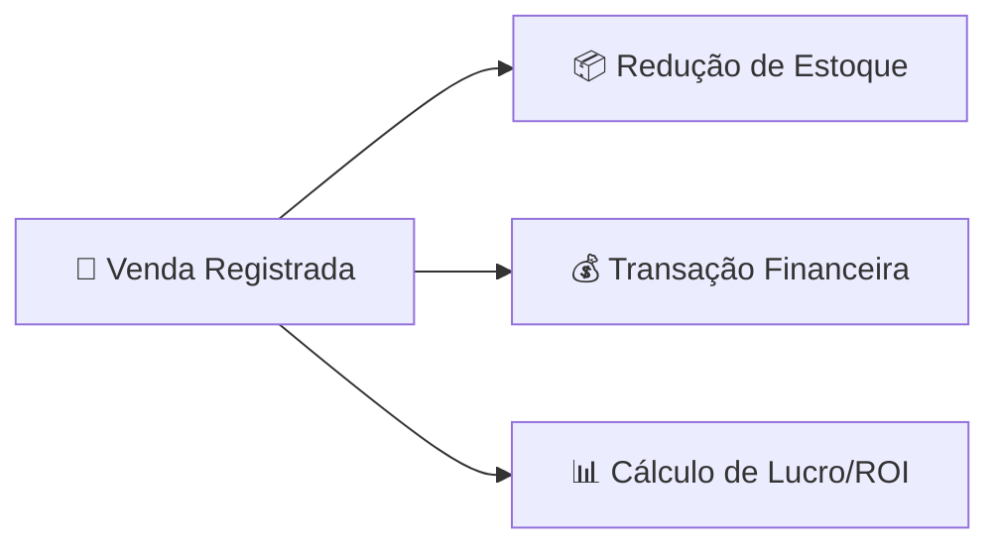
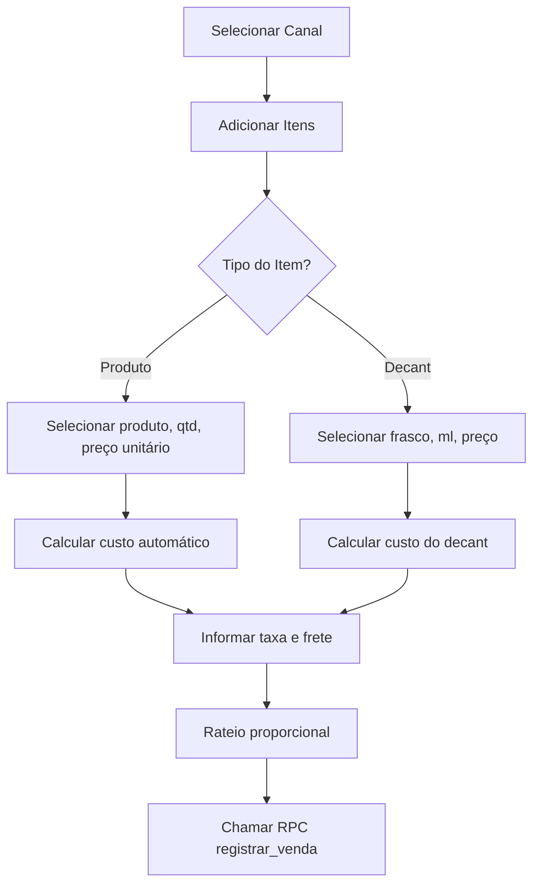

# 🛒 Módulo de Vendas

## Visão Geral

O módulo de Vendas é a ponte central entre o **Estoque** e o **Financeiro** do Horus Parfum Control. Cada venda registrada desencadeia três operações atômicas:

1. **Reduz o estoque** dos produtos/decants vendidos
2. **Gera uma transação financeira** de entrada no módulo financeiro
3. **Calcula lucro e ROI** por item e por venda



> [!IMPORTANT]
> Todas as operações de venda são executadas via **RPCs atômicas** no Supabase. Isso garante que estoque, financeiro e registro de venda estejam sempre consistentes — ou todas as operações são aplicadas, ou nenhuma é.

---

## Funcionalidades

### 📋 Lista de Vendas (`/estoque/vendas`)

Tabela principal com todas as vendas registradas no sistema.

#### Colunas da Tabela

| Coluna | Descrição |
|--------|-----------|
| **Número** | Identificador sequencial da venda |
| **Data** | Data em que a venda foi realizada |
| **Canal** | Canal de venda utilizado (ex: Shopee, Instagram, WhatsApp) |
| **Itens** | Quantidade de itens na venda |
| **Bruto** | Valor bruto total da venda (R$) |
| **Lucro** | Lucro bruto da venda (R$) |
| **ROI** | Retorno sobre investimento (%) |
| **Status** | `concluída` ou `cancelada` |

#### Ações

| Ação | Descrição |
|------|-----------|
| **Nova Venda** | Abre o `NovaVendaModal` para registrar venda |
| **Ver Detalhes** | Abre o `VendaDetalheModal` com informações completas |
| **Cancelar** | Executa a RPC `cancelar_venda` (reverte estoque + financeiro) |

---

### ➕ Nova Venda Modal

O modal de nova venda é um dos componentes mais complexos do sistema (~13KB), responsável por registrar vendas com múltiplos itens, cálculos automáticos e distribuição proporcional de taxas.

#### Fluxo de Registro



#### Tipos de Item

**Produto:**

| Campo | Descrição |
|-------|-----------|
| Produto | Seleção do produto do catálogo |
| Quantidade | Número de unidades |
| Preço Unitário | Preço de venda por unidade |
| Custo (auto) | Calculado automaticamente a partir do `custo_medio` do produto |

**Decant:**

| Campo | Descrição |
|-------|-----------|
| Frasco | Seleção do frasco de origem |
| ML | Mililitros decantados |
| Preço | Preço de venda do decant |
| Custo (auto) | Calculado via `custoDecantUnitario` |

#### Taxa e Frete

Os valores de **taxa** (ex: taxa do marketplace) e **frete** são informados no nível da venda e **distribuídos proporcionalmente** entre os itens.

> [!NOTE]
> O rateio proporcional utiliza o valor bruto de cada item como base de cálculo. O **último item** recebe um ajuste de arredondamento para garantir que a soma dos rateios seja exatamente igual ao valor total de taxa/frete.

#### Execução

Ao confirmar, o modal chama a RPC `registrar_venda`, que executa atomicamente:

1. Cria o registro na tabela `vendas`
2. Cria os registros na tabela `venda_itens`
3. Reduz o estoque dos produtos/frascos
4. Cria a transação financeira de entrada

---

### 📊 Dashboard de Vendas (`/estoque/vendas` → aba dashboard)

Painel analítico com indicadores de desempenho de vendas.

#### Endpoint da API

```
GET /api/estoque/vendas/dashboard?inicio={data_inicio}&fim={data_fim}
```

#### KPIs Retornados

| KPI | Descrição |
|-----|-----------|
| `qtd_vendas` | Número total de vendas no período |
| `itens_vendidos` | Quantidade total de itens vendidos |
| `faturamento_bruto` | Soma dos valores brutos de todas as vendas |
| `total_custo` | Soma dos custos de todos os itens vendidos |
| `lucro_bruto` | `faturamento_bruto - total_custo` |
| `margem_média` | Média da margem de lucro das vendas |
| `roi_médio` | Média do ROI das vendas |
| `ticket_médio` | `faturamento_bruto / qtd_vendas` |

#### Visualizações

| Visualização | Descrição |
|--------------|-----------|
| **Top 10 Produtos** | Ranking dos 10 produtos com maior `lucro_bruto` |
| **Vendas por Canal** | Métricas agrupadas por canal de venda |
| **Evolução Mensal** | Gráfico de evolução mês a mês |
| **Lista de Vendas** | Tabela completa de vendas no período |

---

### ⚙️ Configuração (`/estoque/vendas/config`)

Tela de configurações do módulo de vendas.

#### Canais de Venda

Gerenciamento dos canais por onde as vendas são realizadas.

| Campo | Tipo | Obrigatório | Descrição |
|-------|------|:-----------:|-----------|
| `nome` | `text` | ✅ | Nome do canal (ex: Shopee, Instagram) |
| `taxa_padrao` | `numeric(5,2)` | ❌ | Taxa padrão do canal (%) |
| `ativo` | `boolean` | ✅ | Se o canal está ativo |

#### Embalagens de Decant

Gerenciamento dos tipos de embalagem disponíveis para decants.

| Campo | Tipo | Obrigatório | Descrição |
|-------|------|:-----------:|-----------|
| `tamanho_ml` | `numeric` | ✅ | Tamanho da embalagem em ml |
| `custo` | `numeric(10,2)` | ✅ | Custo unitário da embalagem (R$) |
| `ativo` | `boolean` | ✅ | Se a embalagem está ativa |

---

## Lógica de Negócio (`lib/vendas.ts`)

Todas as funções de cálculo de vendas estão centralizadas em `lib/vendas.ts`.

### Funções de Cálculo

#### `custoDecantUnitario`

Calcula o custo de um decant a partir do frasco original:

```
custoDecantUnitario = (ml × custoMedio) / volumeMl
```

| Variável | Descrição |
|----------|-----------|
| `ml` | Quantidade de ml decantados |
| `custoMedio` | Custo médio do frasco original |
| `volumeMl` | Volume total do frasco original em ml |

#### `brutoItem`

```
brutoItem = precoUnitario × quantidade
```

#### `custoItem`

```
custoItem = (custoUnitario + custoEmbalagem) × quantidade
```

> [!NOTE]
> `custoEmbalagem` é zero para itens do tipo produto. Apenas decants possuem custo de embalagem associado.

#### `roi`

```
roi = lucro / custo
```

Retorna `null` se `custo = 0` (evita divisão por zero).

#### `margem`

```
margem = lucro / bruto
```

Retorna `0` se `bruto = 0` (evita divisão por zero).

#### `ratearProporcional`

Distribui um valor total (taxa ou frete) proporcionalmente entre os itens da venda:

```
rateioItem = (brutoItem / totalBruto) × valorTotal
```

> [!IMPORTANT]
> **Correção do último item**: Para evitar erros de arredondamento, o último item da lista recebe o valor residual (`valorTotal - somaDosDemais`), garantindo que a soma de todos os rateios seja exatamente igual ao valor total.

#### `lucroItem`

```
lucroItem = bruto - custo - taxaRateada - freteRateado
```

#### `resumoVenda`

Calcula o resumo consolidado da venda:

| Campo | Cálculo |
|-------|---------|
| `totalBruto` | Soma de `brutoItem` de todos os itens |
| `totalCusto` | Soma de `custoItem` de todos os itens |
| `receitaLiquida` | `totalBruto - taxa - frete` |
| `lucroBruto` | `receitaLiquida - totalCusto` |

---

## Tabelas do Banco de Dados

### `vendas`

| Coluna | Tipo | Descrição |
|--------|------|-----------|
| `id` | `uuid` | Identificador único (PK) |
| `numero` | `serial` | Número sequencial da venda |
| `canal_id` | `uuid` (FK) | Canal de venda utilizado |
| `data_venda` | `date` | Data da venda |
| `forma_pagamento` | `text` | Método de pagamento |
| `cliente` | `text` | Nome do cliente (opcional) |
| `taxa_total` | `numeric(10,2)` | Valor total de taxas |
| `frete` | `numeric(10,2)` | Valor do frete |
| `total_bruto` | `numeric(10,2)` | Valor bruto total |
| `total_custo` | `numeric(10,2)` | Custo total dos itens |
| `lucro_bruto` | `numeric(10,2)` | Lucro bruto da venda |
| `responsavel` | `text` | Quem registrou a venda |
| `status` | `text` | `concluída` ou `cancelada` |
| `created_at` | `timestamptz` | Data de criação do registro |

### `venda_itens`

| Coluna | Tipo | Descrição |
|--------|------|-----------|
| `id` | `uuid` | Identificador único (PK) |
| `venda_id` | `uuid` (FK) | Referência à venda |
| `tipo` | `text` | `produto` ou `decant` |
| `produto_id` | `uuid` (FK) | Produto vendido (se tipo=produto) |
| `frasco_id` | `uuid` (FK) | Frasco de origem (se tipo=decant) |
| `decant_id` | `uuid` (FK) | Referência ao decant (se tipo=decant) |
| `ml` | `numeric` | ML decantados (se tipo=decant) |
| `quantidade` | `integer` | Quantidade vendida |
| `preco_unitario` | `numeric(10,2)` | Preço de venda unitário |
| `custo_unitario` | `numeric(10,2)` | Custo unitário do item |
| `custo_embalagem` | `numeric(10,2)` | Custo da embalagem (decants) |
| `taxa_rateada` | `numeric(10,2)` | Parcela da taxa atribuída ao item |
| `frete_rateado` | `numeric(10,2)` | Parcela do frete atribuída ao item |
| `lucro` | `numeric(10,2)` | Lucro do item |

### `canais`

| Coluna | Tipo | Descrição |
|--------|------|-----------|
| `id` | `uuid` | Identificador único (PK) |
| `nome` | `text` | Nome do canal |
| `taxa_padrao` | `numeric(5,2)` | Taxa padrão (%) |
| `ativo` | `boolean` | Se o canal está ativo |

### `embalagens_decant`

| Coluna | Tipo | Descrição |
|--------|------|-----------|
| `id` | `uuid` | Identificador único (PK) |
| `tamanho_ml` | `numeric` | Tamanho em ml |
| `custo` | `numeric(10,2)` | Custo unitário (R$) |
| `ativo` | `boolean` | Se a embalagem está ativa |

> [!NOTE]
> Para o schema completo com constraints, índices e relacionamentos, consulte [[BANCO]].

---

## RPCs (Remote Procedure Calls)

O módulo de vendas utiliza duas RPCs do Supabase para garantir operações atômicas.

### `registrar_venda`

Registra uma nova venda no sistema de forma atômica.

**Operações executadas (em transação):**

| Etapa | Operação | Tabela |
|:-----:|----------|--------|
| 1 | Cria o registro da venda | `vendas` |
| 2 | Cria os itens da venda | `venda_itens` |
| 3 | Reduz o estoque de cada item | `produtos` / `movimentacoes` |
| 4 | Cria transação financeira de entrada | `transacoes` (origem='venda') |

### `cancelar_venda`

Cancela uma venda existente, revertendo todas as operações.

**Operações executadas (em transação):**

| Etapa | Operação | Tabela |
|:-----:|----------|--------|
| 1 | Atualiza status da venda para `cancelada` | `vendas` |
| 2 | Reverte o estoque de cada item | `produtos` / `movimentacoes` |
| 3 | Remove ou marca a transação financeira | `transacoes` |

> [!WARNING]
> O cancelamento de uma venda é **irreversível**. Uma vez cancelada, não é possível reativar a venda — seria necessário registrar uma nova venda.

---

## Documentos Relacionados

- [[features/FINANCEIRO]] — Módulo financeiro (recebe transações de vendas)
- [[features/ESTOQUE]] — Módulo de estoque (afetado por vendas)
- [[features/DECANTS]] — Módulo de decants (itens vendáveis)
- [[BANCO]] — Schema completo do banco de dados
- [[REGRAS_NEGOCIO]] — Regras de negócio globais
- [[API]] — Documentação da API backend
